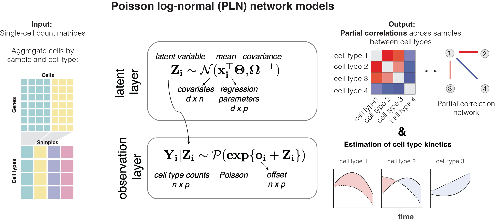

Platt is implemented using the PLNmodels package. PLN models are a multivariate mixed generalized linear model with a Poisson distribution, allowing them to overcome the computational challenges posed by count data. They provide a convenient framework to perform multivariate statistical regression to describe how environmental effects or perturbations alter the relative abundances of each species.

This is inline math: \( E = mc^2 \).

Test: $$ E = mc^2 $$

Correlations between pairs of species is captured by the variance matrix $\Sigma$. 
whereas partial correlations are encoded by its inverse: the precision matrix $\Omega$. 

The PLN network model for multivariate count data can be viewed as a PLN model with a constraint on the coefficients of $\Omega$. ​

Where in this setting, cell types $j$ and $k$ are associated as soon as $\Sigma_k \neq 0$ but are in direct interaction if and only if $\Omega_{jk} \neq 0$​

## References 

1. [J. Chiquet, M. Mariadassou and S. Robin: The Poisson-lognormal model as a versatile framework for the joint analysis of species abundances, Frontiers in Ecology and Evolution, 2021.](https://www.frontiersin.org/articles/10.3389/fevo.2021.588292/full")

2. [J. Chiquet, M. Mariadassou and S. Robin: Variational inference for sparse network reconstruction from count data, Proceedings of the 36th International Conference on Machine Learning (ICML), 2019.](http://proceedings.mlr.press/v97/chiquet19a.html)

3. [J. Chiquet, M. Mariadassou and S. Robin: Variational inference for probabilistic Poisson PCA, the Annals of Applied Statistics, 12: 2674–2698, 2018.](http://dx.doi.org/10.1214/18%2DAOAS1177")