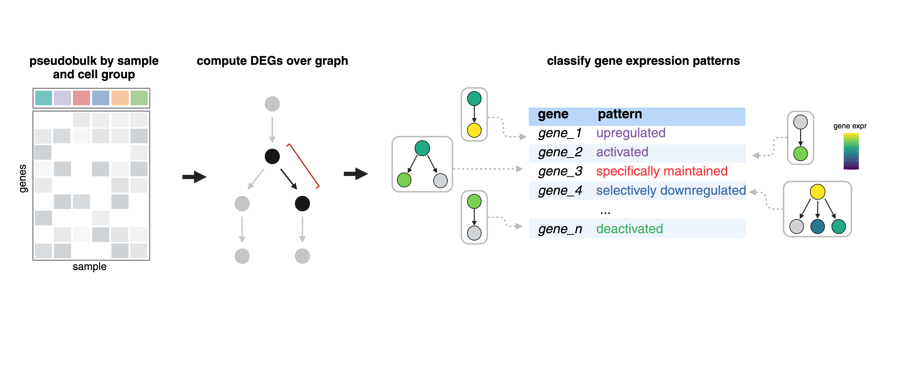
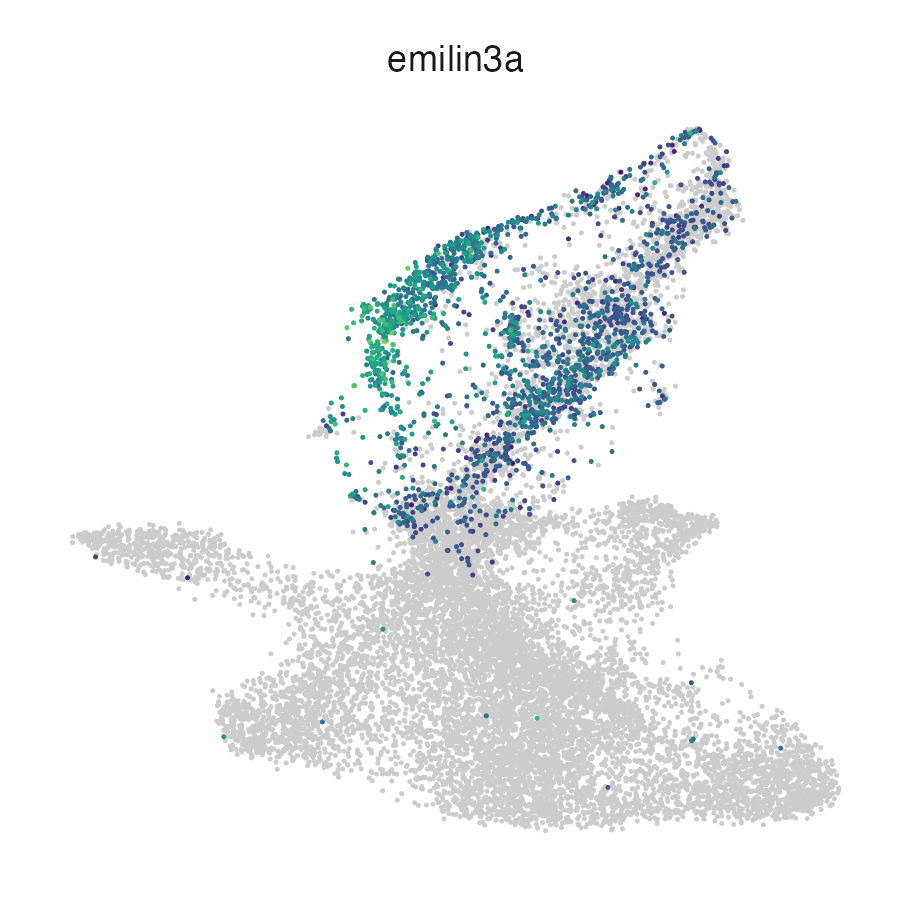
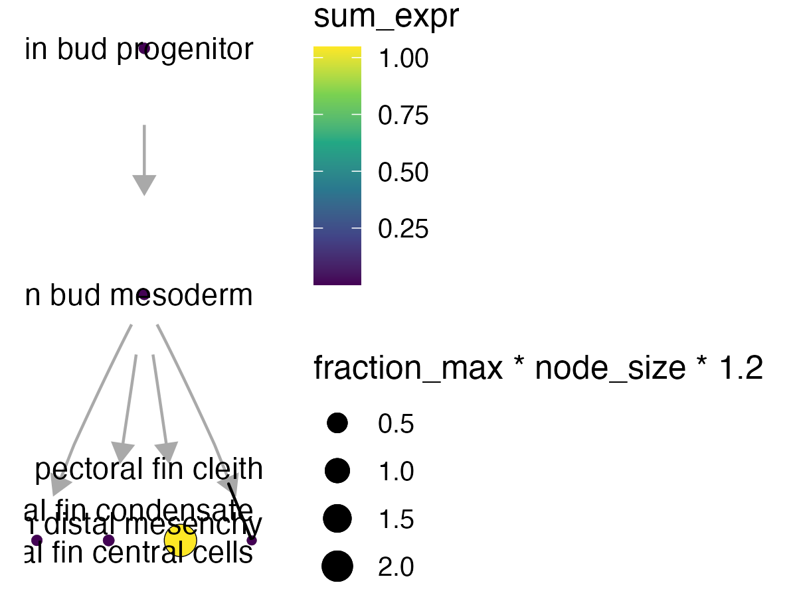
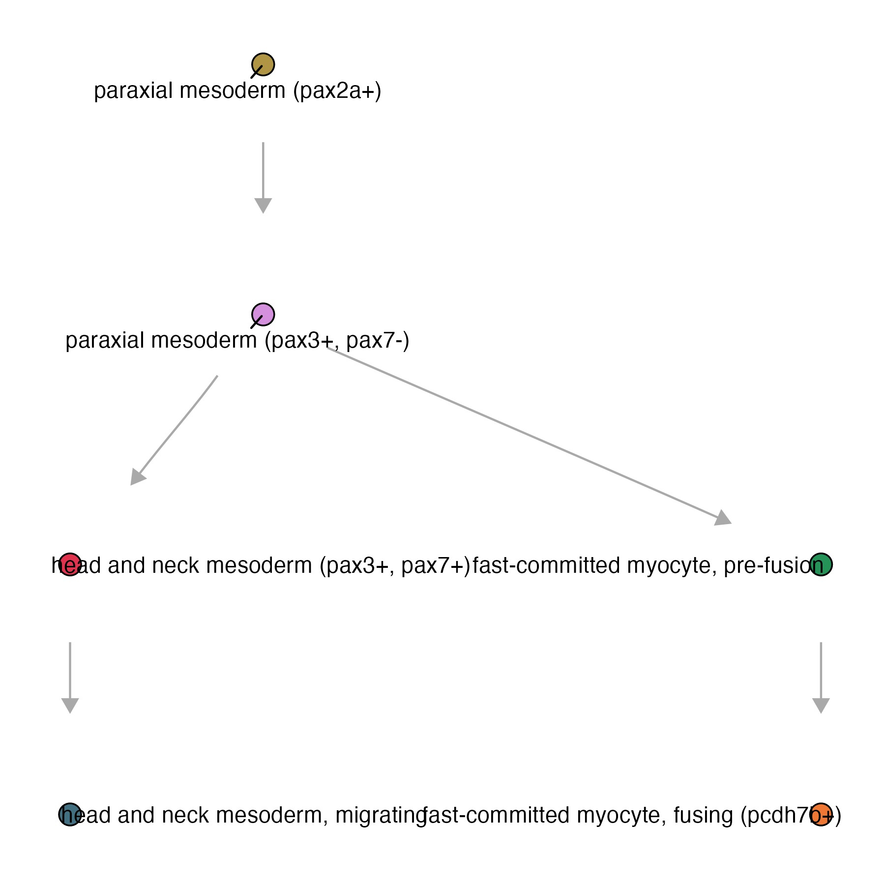
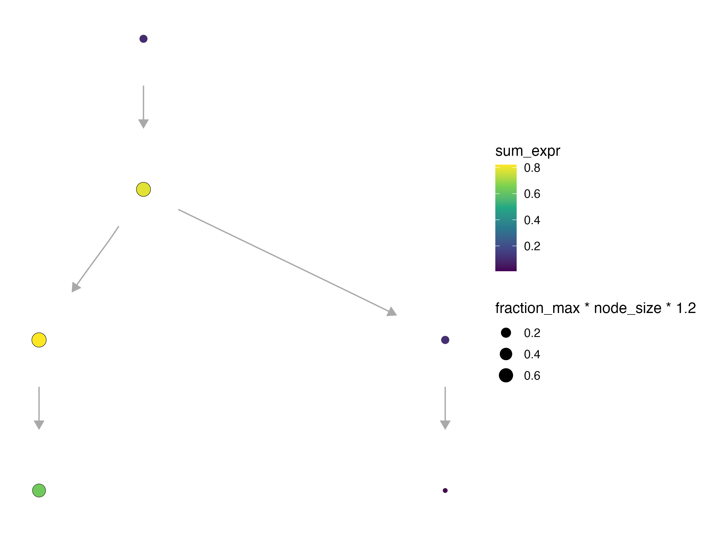
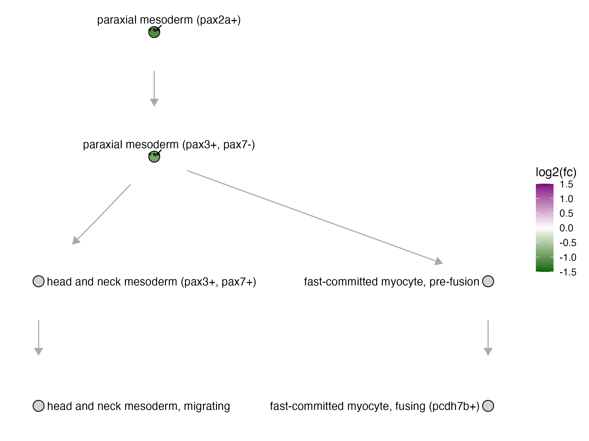

# Differential expression analysis in Platt

## Running DEGs over a graph

Finding regulatory genes with fate-restricted patterns may help identify new genetic requirements of cell types. For example, “terminal selector” and “multilineage priming (MLP)” genes might activate specific fates, genes expressed in progenitors only might be required for maintaining the progenitor states, and genes excluded from certain fates might repress that fate [1-4](https://cole-trapnell-lab.github.io/platt/deg/#references). We can systematically identify these patterns by computing differential expression across our graphs and then classify these patterns based on a set of defined rules.  



_See an explanation of gene patterns [here](https://cole-trapnell-lab.github.io/platt/patterns/):_

The function `compare_genes_within_state_graph()`:

* `ccs`- a Hooke `cell_count_set` object
* `graph` - a Platt `cell_state_graph` object
* `gene_ids` - a list of genes to subset the analysis to 
* `cores` - number of cores 

```
pf_graph_degs = compare_genes_over_graph(pf_ccs,
                                         pf_cell_state_graph, 
                                         cores = 4)
```

The output of this table will look like this: 

| cell_state                     | gene_class_scores         |
|--------------------------------|---------------------------|
| pectoral fin condensate        | `<tibble [14,899 × 5]>`   |
| pectoral fin distal mesenchyme | `<tibble [14,899 × 5]>`   |
| pectoral fin central cells     | `<tibble [14,899 × 5]>`   |
| pectoral fin bud mesoderm      | `<tibble [14,899 × 5]>`   |
| pectoral fin cleithrum         | `<tibble [14,899 × 5]>`   |
| pectoral fin bud progenitor    | `<tibble [14,899 × 5]>`   |

To unnest the dataframe: 

```
pf_graph_degs %>% 
  tidyr::unnest(gene_class_scores) %>% 
  filter(pattern_activity_score > 1) %>%
  filter(interpretation == "Selectively activated")
  
```

| cell_state              | gene_id             | data    | interpretation       | pattern_activity_score | gene_short_name |
|-------------------------|---------------------|---------|----------------------|------------------------|-----------------|
| pectoral fin condensate | ENSDARG000000062…  | `<tibble>` | Selectively activated      | 1.02                   | ell2            |
| pectoral fin condensate | ENSDARG000000099…  | `<tibble>` | Selectively activated      | 2.16                   | slc38a5a        |
| pectoral fin condensate | ENSDARG000000106…  | `<tibble>` | Selectively activated      | 1.86                   | clic2           |
| pectoral fin condensate | ENSDARG000000116…  | `<tibble>` | Selectively activated      | 1.19                   | slc26a2         |
| pectoral fin condensate | ENSDARG000000124…  | `<tibble>` | Selectively activated      | 3.77                   | col11a2         |
| pectoral fin condensate | ENSDARG000000309…  | `<tibble>` | Selectively activated      | 2.00                   | mybl1           |

We can check some of these markers by plotting them either in the UMAP space:

```
plot_cells(pf_ccs@cds, genes = c("emilin3a"))
```

{width=50%}

... or on our platt graph:

```
plot_gene_expr(pf_cell_state_graph, genes = c("emilin3a"))
```

{width=75%}

_For more information about plotting on a Platt graph, see our [plotting page](https://cole-trapnell-lab.github.io/platt/plotting)._

## Running DEGs within each perturbation

The function `compare_genes_within_state_graph()`: 

* `ccs`- a Hooke `cell_count_set` object
* `perturbation_col` - column name of the perturbations
* `control_ids` - list of control ids 
* `cell_groups` - subset of cell groups to run DEGs on 
* `perturbations` - defaults to perturbation
* `cores`

For this example we will be using a subset of the skeletal muscle, for which we have 510,093 reference cells: 

```
platt:::plot_annotations(muscle_state_graph, plot_labels = T, node_size = 4)

```
{width=75%}


```
genes_within_cell_state = compare_genes_within_state_graph(ccs, 
                                                           perturbation_col = "gene_target", 
                                                           control_ids = c("ctrl-inj"), 
                                                           perturbations = c("tbx16", "tbx16-msgn1", "tbx16-tbx16l"),
                                                           cores = 6)
                                                           
genes_within_cell_state %>% head()

```

| cell_group                               | genes_within_cell_group | 
|------------------------------------------|-------------------------|
| paraxial mesoderm (tbx16+)               | `<tibble [33,189 × 15]>`  | 
| paraxial mesoderm (pax3+, pax7-)         | `<tibble [33,189 × 15]>`  | 
| fast-committed myocyte, pre-fusion       | `<tibble [33,189 × 15]>`  |
| fast-committed myocyte, fusing (pcdh7b+) | `<tibble [33,189 × 15]>`  |
| head and neck mesoderm (pax3+, pax7+)    | `<tibble [33,189 × 15]>`  |
| head and neck mesoderm, migrating        | `<tibble [33,189 × 15]>`  |

The results are nested by cell type. To look at a specific knockout term, you can unnest the dataframe and filter: 
```
genes_within_cell_state = genes_within_cell_state %>% tidyr::unnest(genes_within_cell_group)
genes_within_cell_state %>% filter(term == "tbx16,msgn1") %>% tidyr::unnest(perturb_effects)

```

| term       | mean_log_sf | ctrl_log_sf | detected_genes | ctrl_detected_genes | id                  | perturb_to_ctrl_raw_lfc | perturb_to_ctrl_raw_lfc_se | perturb_to_ctrl_raw_p_value | perturb_to_ctrl_shrunken_lfc | perturb_to_ctrl_shrunken_lfc_se | perturb_to_ctrl_p_value | effect_skew | log_mean_expression | coefficient_mode | cell_group                     |
|------------|------------|-------------|----------------|----------------------|----------------------|-------------------------|----------------------------|----------------------------|-----------------------------|-------------------------------|-------------------------|--------------|---------------------|-----------------|--------------------------------|
| tbx16,msgn1 | 3.955547   | 2.302981    | 6042.273       | 2235.279             | ENSDARG00000000002   | -0.08138754             | 0.8304913                  | 0.46096644                 | -0.007389409                | 0.25044809                    | 0.7034408               | -2.799458    | -5.560817           | -0.02203216     | paraxial mesoderm (tbx16+)     |
| tbx16,msgn1 | 3.955547   | 2.302981    | 6042.273       | 2235.279             | ENSDARG00000000018   | 0.88256012              | 0.3981750                  | 0.01332819                 | 0.314546764                 | 0.34338591                    | 0.3002582               | -2.799458    | -3.133384           | -0.02203216     | paraxial mesoderm (tbx16+)     |
| tbx16,msgn1 | 3.955547   | 2.302981    | 6042.273       | 2235.279             | ENSDARG00000000019   | 0.04861553              | 0.2461786                  | 0.42172566                 | 0.014027290                 | 0.13301079                    | 0.7339044               | -2.799458    | -2.514816           | -0.02203216     | paraxial mesoderm (tbx16+)     |
| tbx16,msgn1 | 3.955547   | 2.302981    | 6042.273       | 2235.279             | ENSDARG00000000068   | 0.03918378              | 0.3448263                  | 0.45476421                 | 0.008933895                 | 0.16490703                    | 0.7267108               | -2.799458    | -3.313506           | -0.02203216     | paraxial mesoderm (tbx16+)     |
| tbx16,msgn1 | 3.955547   | 2.302981    | 6042.273       | 2235.279             | ENSDARG00000000069   | 0.22385107              | 0.2309466                  | 0.16620371                 | 0.076271650                 | 0.15154521                    | 0.5804131               | -2.799458    | -2.281009           | -0.02203216     | paraxial mesoderm (tbx16+)     |
| tbx16,msgn1 | 3.955547   | 2.302981    | 6042.273       | 2235.279             | ENSDARG00000000086   | -0.04488597             | 0.1612511                  | 0.39036776                 | -0.014688242                | 0.09378365                    | 0.7574802               | -2.799458    | -1.528009           | -0.02203216     | paraxial mesoderm (tbx16+)     |

Pax3a is a MLP gene observed in paraxial mesoderm progenitors as they commit to either head and neck mesoderm or fast muscle fates. 

```
plot_gene_expr(muscle_state_graph, genes = c("pax3a"), node_size = 4, plot_labels = F) + 
  theme(legend.position = "right")
```
{width=75%}


In the tbx16-msgn1 crispants, all of which fail to generate skeletal muscle properly, _pax3a_, 
a key regulator of myogenesis was differentially expressed in myogenic progenitors. 


| term         | cell_group                          | gene_short_name | perturb_to_ctrl_shrunken_lfc | perturb_to_ctrl_p_value |
|-------------|-------------------------------------|----------------|------------------------------|-------------------------|
| tbx16,msgn1 | paraxial mesoderm (tbx16+)         | pax3a          | -1.0584180                   | 1.397403e-08           |
| tbx16,msgn1 | paraxial mesoderm (pax3+, pax7-)  | pax3a          | -0.7609017                   | 2.913705e-05           |


... we can plot the DEG fold change of _pax3a_ in the tbx16-msgn1 mutant on the platt graph: 

```
plot_degs(muscle_state_graph, tbx16_degs %>% 
            filter(term == "tbx16,msgn1", gene_short_name == "pax3a"), node_size = 4.5)
```

{width=75%}

_For more information about plotting on a Platt graph, see our [plotting page](https://cole-trapnell-lab.github.io/platt/plotting)._


## References
1.	Hobert, O. Terminal selectors of neuronal identity. Curr. Top. Dev. Biol. 116, 455–475 (2016).
2.	Laslo, P. et al. Multilineage transcriptional priming and determination of alternate hematopoietic cell fates. Cell 126, 755–766 (2006).
3.	Qiu, C. et al. Systematic reconstruction of cellular trajectories across mouse embryogenesis. Nat. Genet. 54, 328–341 (2022).
4.	Packer, J. S. et al. A lineage-resolved molecular atlas of C. elegans embryogenesis at single-cell resolution. Science 365, (2019).

