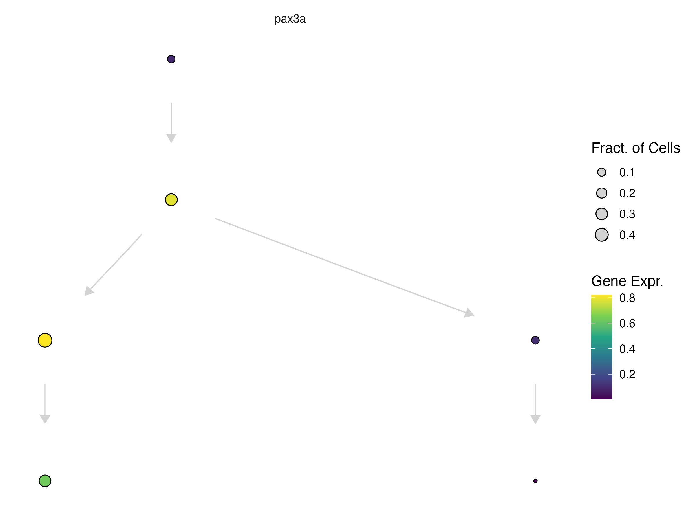

# Running DEGs over a graph


_See an explanation of gene patterns [here](https://cole-trapnell-lab.github.io/platt/patterns/):_

The function `compare_genes_within_state_graph()`:

* `ccs`- a Hooke `cell_count_set` object
* `graph`
* `gene_ids`
* `cores`

```
pf_graph_degs = compare_genes_over_graph(pf_ccs,
                                         pf_cell_state_graph)
```

The output of this table will look like this: 

| cell_state                     | gene_class_scores        |
|--------------------------------|-------------------------|
| pectoral fin condensate        | `<tibble [14,899 × 5]>`   |
| pectoral fin distal mesenchyme | `<tibble [14,899 × 5]>`   |
| pectoral fin central cells     | `<tibble [14,899 × 5]>`   |
| pectoral fin bud mesoderm      | `<tibble [14,899 × 5]>`   |
| pectoral fin cleithrum         | `<tibble [14,899 × 5]>`   |
| pectoral fin bud progenitor    | `<tibble [14,899 × 5]>`   |

To unnest the dataframe: 

```
pf_graph_degs %>% 
  tidyr::unnest(gene_class_scores) %>% 
  filter(pattern_activity_score > 1) %>%
  filter(interpretation == "Selectively activated")
  
```

| cell_state              | gene_id             | data    | interpretation       | pattern_activity_score | gene_short_name |
|-------------------------|---------------------|---------|----------------------|------------------------|-----------------|
| pectoral fin condensate | ENSDARG000000062…  | `<tibble>` | Selectively activated      | 1.02                   | ell2            |
| pectoral fin condensate | ENSDARG000000099…  | `<tibble>` | Selectively activated      | 2.16                   | slc38a5a        |
| pectoral fin condensate | ENSDARG000000106…  | `<tibble>` | Selectively activated      | 1.86                   | clic2           |
| pectoral fin condensate | ENSDARG000000116…  | `<tibble>` | Selectively activated      | 1.19                   | slc26a2         |
| pectoral fin condensate | ENSDARG000000124…  | `<tibble>` | Selectively activated      | 3.77                   | col11a2         |
| pectoral fin condensate | ENSDARG000000309…  | `<tibble>` | Selectively activated      | 2.00                   | mybl1           |

We can check some of these markers by plotting them either in the UMAP space or on our platt graph:


```
plot_cells(pf_ccs@cds, genes = c())
```


```
plot_gene_expr(pf_cell_state_graph, genes = c())
```


_For more information about plotting on a Platt graph, see our [plotting page](https://cole-trapnell-lab.github.io/platt/plotting)._

# Running DEGs within each perturbation

```
chem10_cds = load_monocle_objects("/net/trapnell/vol1/home/elizab9/projects/projects/CHEMFISH/manuscript/data/chem10_projected_comb_cds_v2.0.2_remove_outliers")

chem10_ccs = new_cell_count_set(chem10_cds,
                         sample_group = "embryo",
                         cell_group = "cell_type")
```

The function `compare_genes_within_state_graph()`: 

* `ccs`- a Hooke `cell_count_set` object
* `perturbation_col` - column name of the perturbations
* `control_ids` - list of control ids 
* `cell_groups` - subset of cell groups to run DEGs on 
* `perturbations` - defaults to perturbation
* `cores`

```
genes_within_cell_state = compare_genes_within_state_graph(ccs, 
                                                           perturbation_col = "gene_target", 
                                                           control_ids = c("ctrl-inj"), 
                                                           perturbations = c("tbx16", "tbx16-msgn1", "tbx16-tbx16l"),
                                                           cores = 6)
```

| cell_group                               | genes_within_cell_group | 
|------------------------------------------|-------------------------|
| paraxial mesoderm (tbx16+)               | <tibble [33,189 × 15]>  | 
| paraxial mesoderm (pax3+, pax7-)         | <tibble [33,189 × 15]>  | 
| fast-committed myocyte, pre-fusion       | <tibble [33,189 × 15]>  |
| fast-committed myocyte, fusing (pcdh7b+) | <tibble [33,189 × 15]>  |
| head and neck mesoderm (pax3+, pax7+)    | <tibble [33,189 × 15]>  |
| head and neck mesoderm, migrating        | <tibble [33,189 × 15]>  |


```
genes_within_cell_state %>% filter(term == "tbx16,msgn1")
```

| term       | mean_log_sf | ctrl_log_sf | detected_genes | ctrl_detected_genes | id                  | perturb_to_ctrl_raw_lfc | perturb_to_ctrl_raw_lfc_se | perturb_to_ctrl_raw_p_value | perturb_to_ctrl_shrunken_lfc | perturb_to_ctrl_shrunken_lfc_se | perturb_to_ctrl_p_value | effect_skew | log_mean_expression | coefficient_mode | cell_group                     |
|------------|------------|-------------|----------------|----------------------|----------------------|-------------------------|----------------------------|----------------------------|-----------------------------|-------------------------------|-------------------------|--------------|---------------------|-----------------|--------------------------------|
| tbx16,msgn1 | 3.955547   | 2.302981    | 6042.273       | 2235.279             | ENSDARG00000000002   | -0.08138754             | 0.8304913                  | 0.46096644                 | -0.007389409                | 0.25044809                    | 0.7034408               | -2.799458    | -5.560817           | -0.02203216     | paraxial mesoderm (pax2a+)     |
| tbx16,msgn1 | 3.955547   | 2.302981    | 6042.273       | 2235.279             | ENSDARG00000000018   | 0.88256012              | 0.3981750                  | 0.01332819                 | 0.314546764                 | 0.34338591                    | 0.3002582               | -2.799458    | -3.133384           | -0.02203216     | paraxial mesoderm (pax2a+)     |
| tbx16,msgn1 | 3.955547   | 2.302981    | 6042.273       | 2235.279             | ENSDARG00000000019   | 0.04861553              | 0.2461786                  | 0.42172566                 | 0.014027290                 | 0.13301079                    | 0.7339044               | -2.799458    | -2.514816           | -0.02203216     | paraxial mesoderm (pax2a+)     |
| tbx16,msgn1 | 3.955547   | 2.302981    | 6042.273       | 2235.279             | ENSDARG00000000068   | 0.03918378              | 0.3448263                  | 0.45476421                 | 0.008933895                 | 0.16490703                    | 0.7267108               | -2.799458    | -3.313506           | -0.02203216     | paraxial mesoderm (pax2a+)     |
| tbx16,msgn1 | 3.955547   | 2.302981    | 6042.273       | 2235.279             | ENSDARG00000000069   | 0.22385107              | 0.2309466                  | 0.16620371                 | 0.076271650                 | 0.15154521                    | 0.5804131               | -2.799458    | -2.281009           | -0.02203216     | paraxial mesoderm (pax2a+)     |
| tbx16,msgn1 | 3.955547   | 2.302981    | 6042.273       | 2235.279             | ENSDARG00000000086   | -0.04488597             | 0.1612511                  | 0.39036776                 | -0.014688242                | 0.09378365                    | 0.7574802               | -2.799458    | -1.528009           | -0.02203216     | paraxial mesoderm (pax2a+)     |


We can plot the fold change on the platt graph: 


```
platt:::plot_annotations(muscle_state_graph, plot_labels = T, node_size = 4)

```
{width=75%}


```
plot_gene_expr(muscle_state_graph, genes = c("pax3a"), node_size = 4, plot_labels = F) + 
  theme(legend.position = "right")
```
{width=75%}


```
plot_degs(muscle_state_graph, tbx16_degs %>% left_join(gene_df, by = "id") %>% 
            filter(term == "tbx16,msgn1", gene_short_name == "pax3a"), node_size = 4.5)
```

{width=75%}

_For more information about plotting on a Platt graph, see our [plotting page](https://cole-trapnell-lab.github.io/platt/plotting)._
