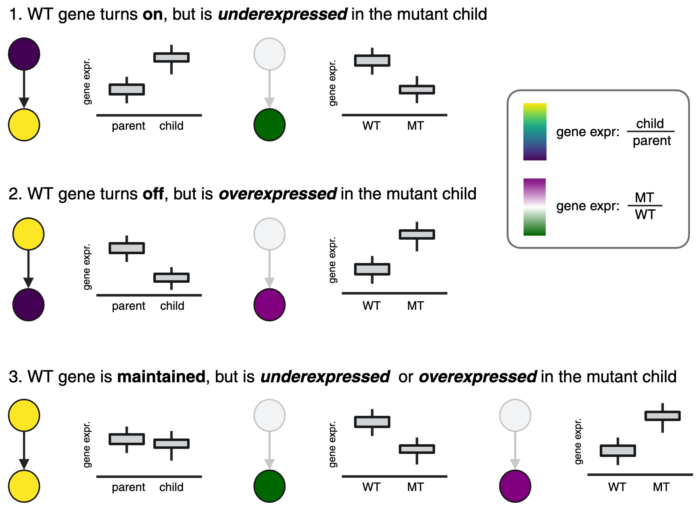

# Deviantly expressed genes (DvEGs)




Genes are “deviantly expressed” (DvEG) in each perturbation, when they are upregulated during a transition in wild-type, but are under- or overexpressed in perturbed cells undergoing that same transition relative to controls. 

```

dvegs = calculate_dvegs(perturb_degs, 
                       perturbation_table, 
                       ref_abundances, 
                       ref_degs)

```


