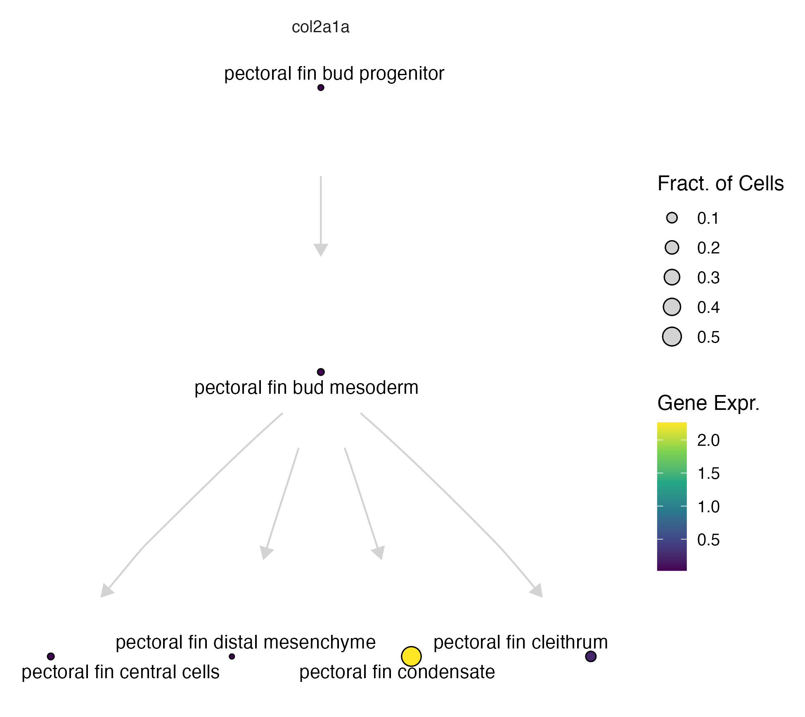
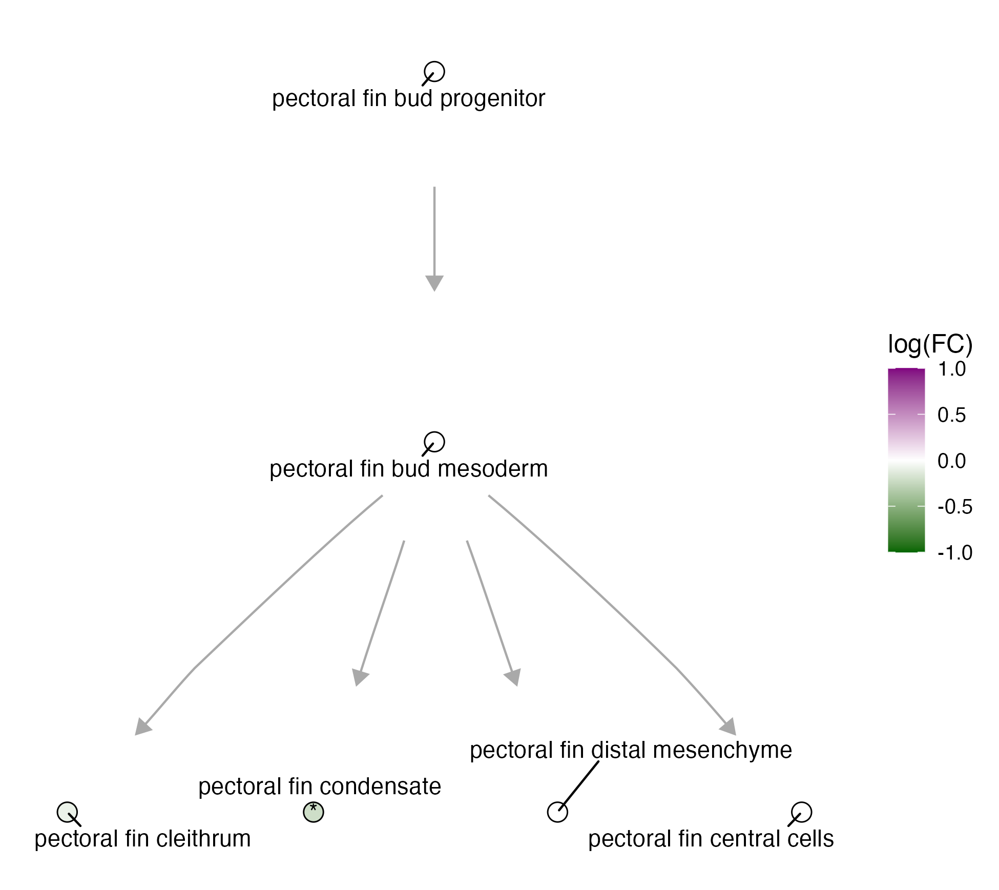

# Deviantly expressed genes (DvEGs)

{width=75%}


Genes are “deviantly expressed” (DvEG) in each perturbation, if they are 1) upregulated during a wild-type transition wild-type, but are underexpressed in perturbed cells undergoing that same transition relative to controls or 2) downregulated during a wild-type transition overexpressed in perturbed cells, but are overexpressed in perturbed cells undergoing that same transition relative to controls. 


The function `calculate_dvegs()` takes in the following inputs: 

* `perturb_degs` - output of `compare_genes_within_state_graph`
* `ref_degs` - output of `compare_genes_over_graph`
* `sig_p_val_thresh`

```
sig_dvegs = calculate_dvegs(perturb_degs, 
                            ref_degs, 
                            sig_p_val_thresh = 0.05)

```

We can look for deviantly expressed genes in the pectoral fin in the lmx1b crispant. We first need to run WT and MT degs using `compare_genes_over_graph` and `compare_genes_within_state_graph`. _For more information on these functions see our [DEG page.](https://cole-trapnell-lab.github.io/platt/deg/)_

```
pf_graph_degs = compare_genes_over_graph(pf_ccs,
                                         pf_cell_state_graph, 
                                         cores = 4)
                                         
perturb_degs = compare_genes_within_state_graph(ccs, 
                                                perturbation_col = "gene_target", 
                                                control_ids = c("ctrl-inj"), 
                                                perturbations = c("lmx1ba,lmx1bb"),
                                                cores = 6)
                                                
dvegs = calculate_dvegs(perturb_degs, 
                        pf_graph_degs, 
                        sig_p_val_thresh = 0.05)                                                
                        

```

The gene _col2a1a_ comes up as a deviantly expressed gene in the pectoral fin condensate. In the wild type it is _*specifically upregulated*_, as shown on the Platt graph: 

```
platt:::plot_gene_expr(pf_state_graph, genes = c("col2a1a"))
```


In the lmx1b KO, _col2a1a_ has significantly lower expression in the mutant than in the wild type. We can plot it on the Platt graph:

```
platt:::plot_degs(pf_state_graph, 
                  perturb_degs %>% filter(gene_short_name == "col2a1a"))
```


_For more information on how to plotting Platt graphs, see our [plotting page](https://cole-trapnell-lab.github.io/platt/plotting/)._ 


