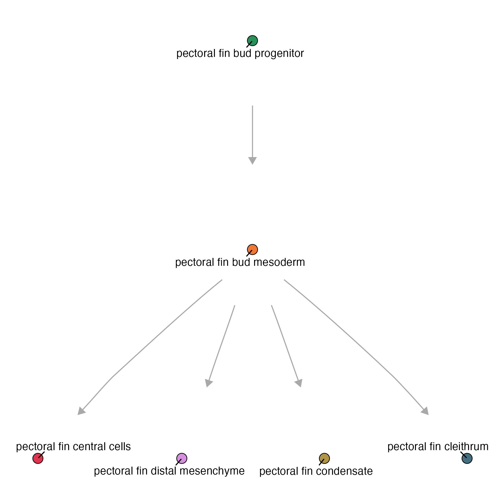

### Platt's graph algorithm: 


Before we build our own graphs, let's use a basic graph example 

```
state_graph = data.frame(from = c("early notochord progenitor", 
                                  "early notochord", 
                                  "early vacuolated notochord",
                                  "early notochord", 
                                  "early notochord sheath"), 
                         to = c("early notochord", 
                                "early vacuolated notochord", 
                                "late vacuolated notochord", 
                                "early notochord sheath", 
                                "late notochord sheath")) %>% 
                         igraph::graph_from_data_frame() 
                      
plot(my_graph)
```

{width=75%}

### Making a cell_state_graph object

The `new_cell_state_graph` function takes the following as input:

* `cell_state_graph` - an igraph object
* `ccs` - a Hooke `cell_count_set` object

```
notochord_state_graph = new_cell_state_graph(state_graph, ccs)
```

### Manipulating graphs

Get the parents:

* `cell_state_graph`
* `cell_state`

```
get_parents(cell_state_graph@graph, cell_state)
```
For example:
```
> get_parents(notochord_state_graph@graph, "early vacuolated notochord")
```
returns
```
> "early notochord"
```

Get the children:

* `cell_state_graph`
* `cell_state` 

```
get_children(cell_state_graph@graph, cell_state)
```
For example:
```
> get_children(notochord_state_graph@graph, "early vacuolated notochord")
```
returns: 
```
> "late vacuolated notochord"
```

Get the siblings:

* `cell_state_graph`
* `cell_state`

```
get_siblings(cell_state_graph@graph, cell_state)
```
For example: 
```
> get_siblings(notochord_state_graph@graph, "early vacuolated notochord")
```
returns
```
> "early notochord sheath"
```


### Constructing a graph

To construct a platt graph: 

_To review these functions, see our [kinetics page](https://cole-trapnell-lab.github.io/platt/kinetics/)._

```
make_platt_graph()

```


```
plot_annotations(pf_state_graph, node_size = 4.5)
```

{width=75%}

_For more information about plotting on a Platt graph, see our [Plotting page](https://cole-trapnell-lab.github.io/platt/plotting/)_


