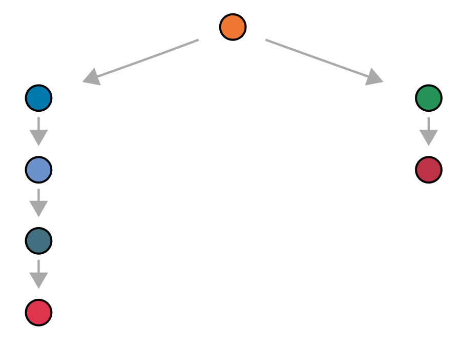
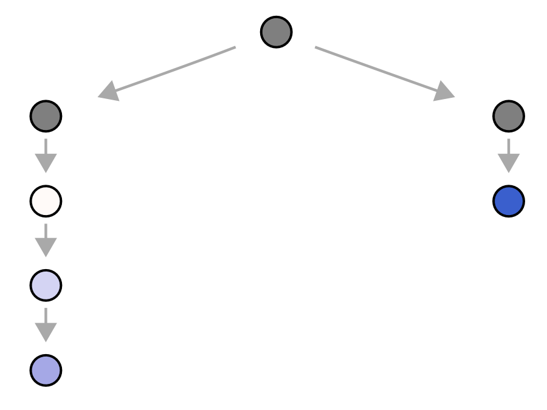
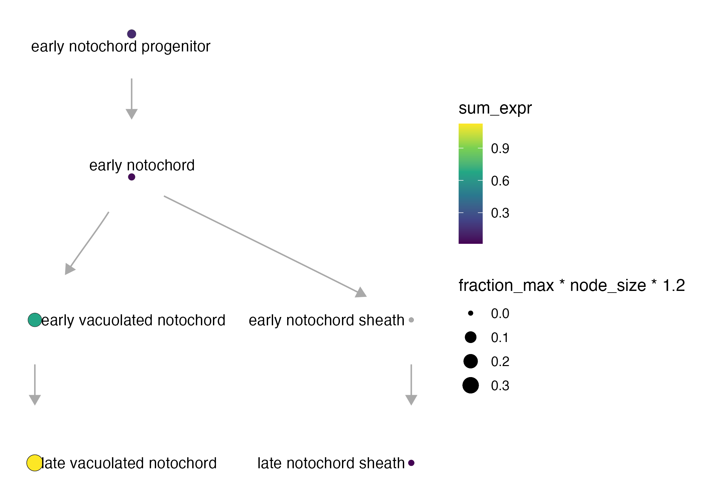
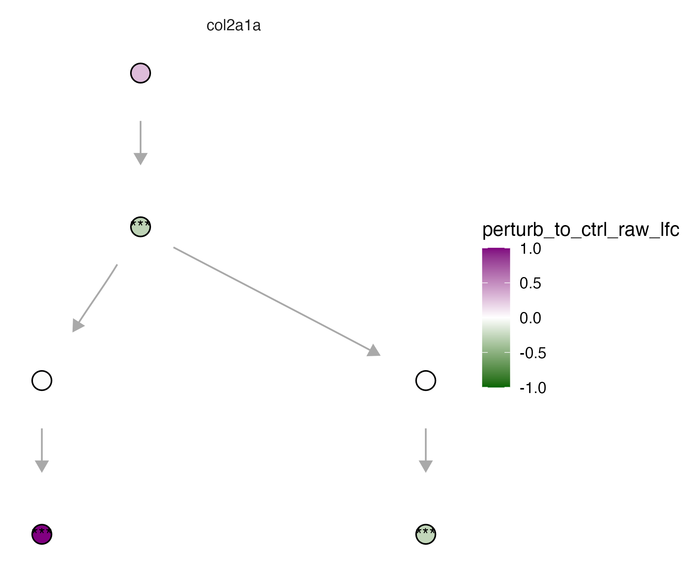

Before we build our own graphs, let's use a basic graph example 

```
my_graph = data.frame(from = c(), to = c()) %>% igraph::graph_from_data_frame() 
```

### Manipulating graphs

Get the parents
* `state_graph`
* `cell_state`
```
get_parents(state_graph, cell_state)
```

Get the children
* `state_graph`
* `cell_state` 
```
get_children(state_graph, cell_state)
```

Get the siblings
* `state_graph`
* `cell_state`
```
get_siblings(state_graph, cell_state)
```


### Making a cell_state_graph object

* `state_graph` - an igraph object
* `ccs` - a Hooke `cell_count_set` object

```
state_graph = new_cell_state_graph(state_graph, ccs)
```

### Plotting a cell_state_graph

The function `plot_annotations()`
* `cell_state_graph`
* `color_nodes_by`
* `label_nodes_by`
```
plot_annotations(noto_state_graph, node_size = 4.5)
```


The function `plot_abundance_changes()`
* `cell_state_graph`
* `comp_abund_table`

```
plot_abundance_changes(noto_state_graph, lmx_fc %>% filter(timepoint_x==60),  node_size = 4.5)
```


The function `plot_gene_expr`
* `cell_state_graph`
* `genes`

```
plot_gene_expr(noto_state_graph, genes=c("lmx1bb"))
```



The function `plot_degs`
* `cell_state_graph`
* `deg_table`

```
plot_degs(noto_state_graph, num_degs, node_size = 4.5)
```

