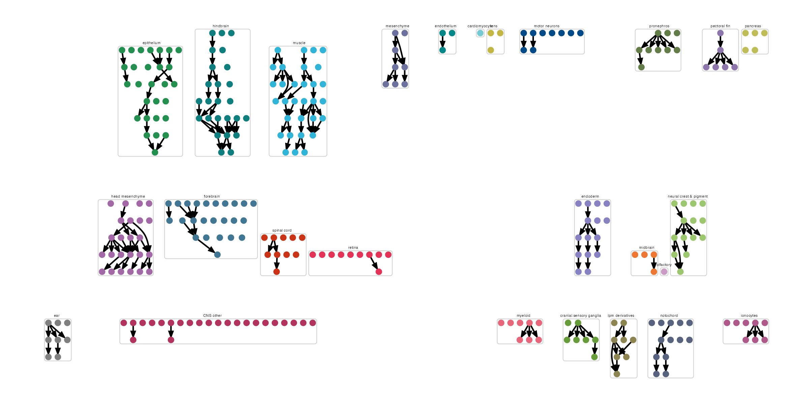

### Platt's graph algorithm: 


Before we build our own graphs, let's use a basic graph example 

```
state_graph = data.frame(from = c("early notochord progenitor", 
                                  "early notochord", 
                                  "early vacuolated notochord",
                                  "early notochord", 
                                  "early notochord sheath"), 
                         to = c("early notochord", 
                                "early vacuolated notochord", 
                                "late vacuolated notochord", 
                                "early notochord sheath", 
                                "late notochord sheath")) %>% 
                         igraph::graph_from_data_frame() 
                      
plot(my_graph)
```

{width=75%}

### Making a cell_state_graph object

The `new_cell_state_graph` function takes the following as input:

* `cell_state_graph` - an igraph object
* `ccs` - a Hooke `cell_count_set` object

```
notochord_state_graph = new_cell_state_graph(state_graph, ccs)
plot_annotations(notochord_state_graph, node_size = 4.5)
```
{width=75%}


### Larger graphs

if you have a larger graph that you want to plot by tissue level annotation, you can specify 
a grouping in `new_cell_state_graph` and the number of layers you want to arrange each group in 

```
ref_state_graph = new_cell_state_graph(combined_state_graph, 
                                       ref_ccs, 
                                       group_nodes_by="projection_group", 
                                       num_layers=3)


plot_by_annotations(ref_state_graph) + theme(legend.position = "none")

```


{width=75%}


### Manipulating graphs

Get the parents:

* `cell_state_graph`
* `cell_state`

```
get_parents(cell_state_graph@graph, cell_state)
```
For example:
```
> get_parents(notochord_state_graph@graph, "early vacuolated notochord")
```
returns
```
> "early notochord"
```

Get the children:

* `cell_state_graph`
* `cell_state` 

```
get_children(cell_state_graph@graph, cell_state)
```
For example:
```
> get_children(notochord_state_graph@graph, "early vacuolated notochord")
```
returns: 
```
> "late vacuolated notochord"
```

Get the siblings:

* `cell_state_graph`
* `cell_state`

```
get_siblings(cell_state_graph@graph, cell_state)
```
For example: 
```
> get_siblings(notochord_state_graph@graph, "early vacuolated notochord")
```
returns
```
> "early notochord sheath"
```


### Constructing a graph

To construct a platt graph: 

```
partition_res = assemble_partition(cds, 
                                   partition_name = "pectoral fin",
                                   sample_group = "embryo",
                                   cell_group = "cell_type",
                                   interval_col = "timepoint",
                                   component_col = "assembly_group",
                                   perturbation_col = "perturbation",
                                   ctrl_ids = c("ctrl-inj"),
                                   num_threads = 6,
                                   batch_col = "expt")

```


| data                  | wt_graph | mt_graph | perturbation_effects | perturbation_table     | mt_graph_denylist | mt_graph_denylist_plot |
|-----------------------|----------|----------|------------------------|-------------------------|--------------------|--------------------------|
| `<tibble [29,181 × 6]>` | `<igraph>` | `<igraph>` | `<tibble [27 × 2]> `     | `<tibble [1,422 × 23]>`   | `<lgl [1]>`          | `<lgl [1]>`                |


```

pf_graph = partition_res$mt_graph[[1]]
pf_ccs = new_cell_count_set(pf_cds, cell_group = "cell_type", sample_group = "embryo")
pf_csg = new_cell_state_graph(pf_graph, pf_ccs)

plot_annotations(pf_csg, node_size = 4.5)
```

{width=75%}

_For more information about plotting on a Platt graph, see our [Plotting page](https://cole-trapnell-lab.github.io/platt/plotting/)_

# 
# ```
# genetic_requirements = categorize_genetic_requirements(res_cluster$perturbation_effects[[1]],
#                                                        mt_graph)
# 
# ```


