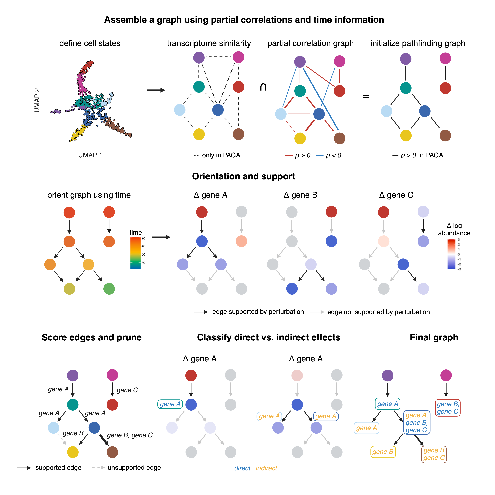
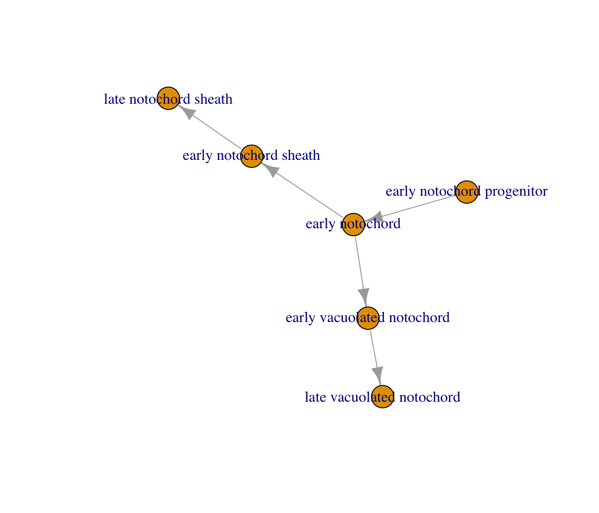
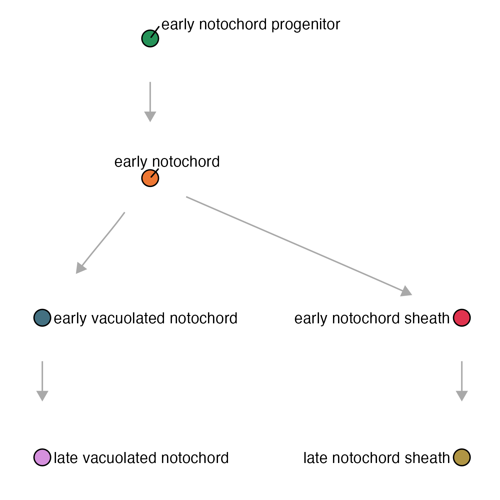
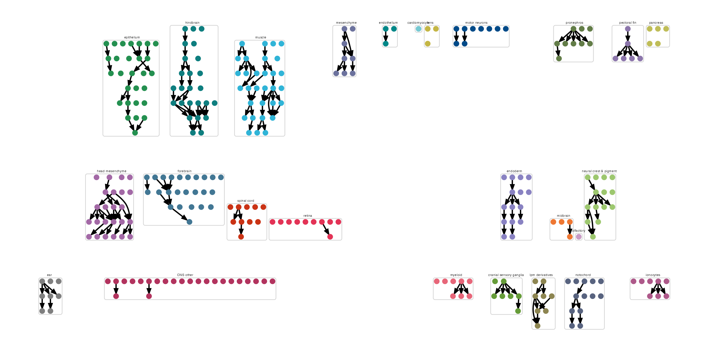
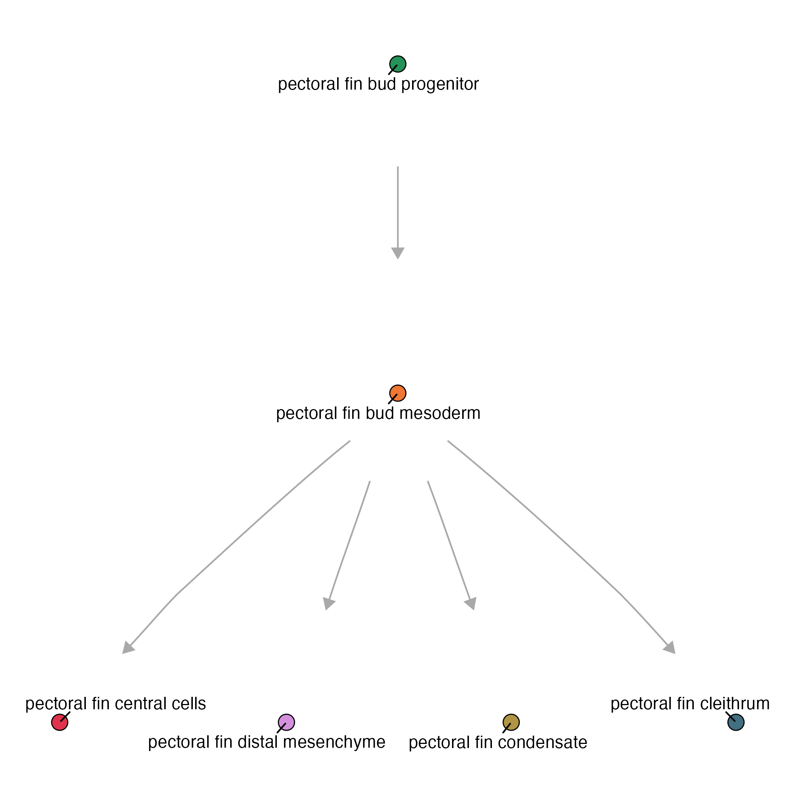

### Platt's graph algorithm: 



Before we build our own graphs, let's use a basic graph example 

```
state_graph = data.frame(from = c("early notochord progenitor", 
                                  "early notochord", 
                                  "early vacuolated notochord",
                                  "early notochord", 
                                  "early notochord sheath"), 
                         to = c("early notochord", 
                                "early vacuolated notochord", 
                                "late vacuolated notochord", 
                                "early notochord sheath", 
                                "late notochord sheath")) %>% 
                         igraph::graph_from_data_frame() 
                      
plot(my_graph)
```

{width=75%}

### Making a cell_state_graph object

The `new_cell_state_graph` function takes the following as input:

* `cell_state_graph` - an igraph object
* `ccs` - a Hooke `cell_count_set` object

```
notochord_state_graph = new_cell_state_graph(state_graph, ccs)
plot_annotations(notochord_state_graph, node_size = 4.5)
```
{width=75%}


### Larger graphs

if you have a larger graph that you want to plot by tissue level annotation, you can specify 
a grouping in `new_cell_state_graph` and the number of layers you want to arrange each group in 

```
ref_state_graph = new_cell_state_graph(combined_state_graph, 
                                       ref_ccs, 
                                       group_nodes_by="projection_group", 
                                       num_layers=3)


plot_annotations(ref_state_graph) + theme(legend.position = "none")

```


{width=75%}


### Manipulating graphs

`get_parents()`, `get_children()`, and `get_siblings()` are internal helpers (not exported from the `platt` namespace), so they're called with `platt:::`.

Get the parents:

* `cell_state_graph`
* `cell_state`

```
platt:::get_parents(cell_state_graph@graph, cell_state)
```
For example:
```
> platt:::get_parents(notochord_state_graph@graph, "early vacuolated notochord")
```
returns
```
> "early notochord"
```

Get the children:

* `cell_state_graph`
* `cell_state` 

```
platt:::get_children(cell_state_graph@graph, cell_state)
```
For example:
```
> platt:::get_children(notochord_state_graph@graph, "early vacuolated notochord")
```
returns: 
```
> "late vacuolated notochord"
```

Get the siblings:

* `cell_state_graph`
* `cell_state`

```
platt:::get_siblings(cell_state_graph@graph, cell_state)
```
For example: 
```
> platt:::get_siblings(notochord_state_graph@graph, "early vacuolated notochord")
```
returns
```
> "early notochord sheath"
```

_`get_all_parents()` is the exported, recursive counterpart of `get_parents()` — it walks all the way up to the root ancestors of a cell state instead of just the immediate parent._


### Constructing a graph

We first construct a graph on clusters, starting with the wild-type (control) samples...

```

cds = cluster_cells(cds, random_seed = 42, res=1e-3)
colData(cds)$cell_state = monocle3:::clusters(cds)

cluster_wt_graph = run_wildtype_assembly(cds, 
                                   partition_name = "pectoral fin",
                                   sample_group = "embryo",
                                   cell_group = "cell_state",
                                   interval_col = "timepoint",
                                   component_col = "assembly_group",
                                   perturbation_col = "perturbation",
                                   ctrl_ids = c("ctrl-inj"),
                                   num_threads = 6,
                                   batch_col = "expt")

```

...then, using that wild-type graph as an anchor, fit the mutant/perturbation samples on top of it:

```

cluster_mt_graph = run_perturbation_assembly(cds,
                                   wt_graph = cluster_wt_graph,
                                   partition_name = "pectoral fin",
                                   sample_group = "embryo",
                                   cell_group = "cell_state",
                                   interval_col = "timepoint",
                                   component_col = "assembly_group",
                                   perturbation_col = "perturbation",
                                   ctrl_ids = c("ctrl-inj"),
                                   num_threads = 6,
                                   batch_col = "expt")

```

_If there's no perturbation data to fit, `run_perturbation_assembly()` just returns the wild-type graph back._

...then contract the cluster-level graph, and use it as an edge prior for a graph built on cell types... 

```

contract_graph = platt::contract_state_graph(ccs, cluster_mt_graph, group_nodes_by = "cell_type")

global_wt_graph_edge_allowlist = igraph::as_data_frame(contract_graph)
global_wt_graph_edge_allowlist = global_wt_graph_edge_allowlist %>% select(from, to) %>% distinct()


cell_type_wt_graph = run_wildtype_assembly(cds, 
                                   partition_name = "pectoral fin",
                                   sample_group = "embryo",
                                   cell_group = "cell_type",
                                   interval_col = "timepoint",
                                   component_col = "assembly_group",
                                   perturbation_col = "perturbation",
                                   edge_allowlist = global_wt_graph_edge_allowlist, 
                                   ctrl_ids = c("ctrl-inj"),
                                   num_threads = 6,
                                   batch_col = "expt")

cell_type_mt_graph = run_perturbation_assembly(cds,
                                   wt_graph = cell_type_wt_graph,
                                   partition_name = "pectoral fin",
                                   sample_group = "embryo",
                                   cell_group = "cell_type",
                                   interval_col = "timepoint",
                                   component_col = "assembly_group",
                                   perturbation_col = "perturbation",
                                   edge_allowlist = global_wt_graph_edge_allowlist, 
                                   ctrl_ids = c("ctrl-inj"),
                                   num_threads = 6,
                                   batch_col = "expt")

```

Each call returns a single `igraph` object (or `NA` if fitting fails), rather than a data frame — `cell_type_wt_graph` is the wild-type state graph, and `cell_type_mt_graph` is the mutant/perturbation graph assembled on top of it. You can go straight from either graph to a `cell_state_graph`:

```

pf_graph = cell_type_mt_graph
pf_ccs = new_cell_count_set(pf_cds, cell_group = "cell_type", sample_group = "embryo")
pf_csg = new_cell_state_graph(pf_graph, pf_ccs)

plot_annotations(pf_csg)

```

{width=75%}

_For more information about plotting on a Platt graph, see our [Plotting page](https://cole-trapnell-lab.github.io/platt/plotting/)_


