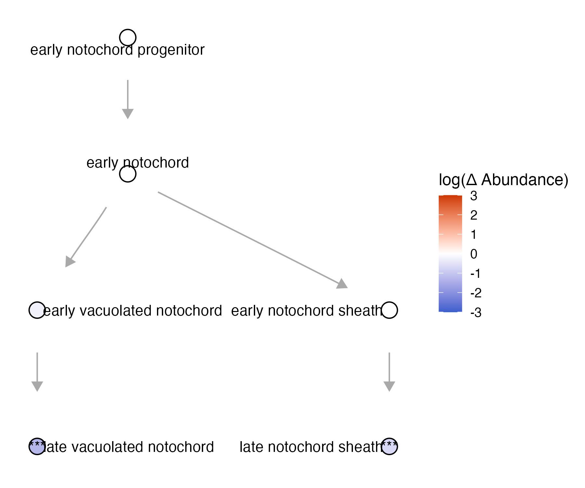

Platt's graph algorithm: 


Before we build our own graphs, let's use a basic graph example 

```
state_graph = data.frame(from = c("early notochord progenitor", "early notochord", "early vacuolated notochord",  "early notochord", "early notochord sheath"), 
                      to = c("early notochord", "early vacuolated notochord", "late vacuolated notochord", "early notochord sheath", "late notochord sheath")) %>% 
                      igraph::graph_from_data_frame() 
                      
plot(my_graph)
```

{width=75%}

### Making a cell_state_graph object

* `cell_state_graph` - an igraph object
* `ccs` - a Hooke `cell_count_set` object

```
notochord_state_graph = new_cell_state_graph(state_graph, ccs)
```

### Manipulating graphs

Get the parents:

* `cell_state_graph`
* `cell_state`

```
get_parents(cell_state_graph, cell_state)
```
For example:
```
> get_parents(notochord_state_graph, "early vacuolated notochord")
```
returns
```
> "early notochord"
```

Get the children:
* `cell_state_graph`
* `cell_state` 

```
get_children(cell_state_graph, cell_state)
```
For example:
```
> get_children(notochord_state_graph, "early vacuolated notochord")
```
returns: 
```
> "late vacuolated notochord"
```

Get the siblings:
* `cell_state_graph`
* `cell_state`

```
get_siblings(cell_state_graph, cell_state)
```
For example: 
```
> get_siblings(notochord_state_graph, "early vacuolated notochord")
```
returns
```
> "early notochord sheath"
```

### Plotting a cell_state_graph

The function `plot_annotations()`: 
* `cell_state_graph`
* `color_nodes_by`
* `label_nodes_by`

```
plot_annotations(notochord_state_graph, node_size = 4.5)
```

{width=75%}

The function `plot_abundance_changes()`:
* `cell_state_graph`
* `comp_abund_table`

```
plot_abundance_changes(notochord_state_graph, lmx_fc %>% filter(timepoint_x==60),  node_size = 4.5)
```

{width=75%}

The function `plot_gene_expr`: 

* `cell_state_graph`
* `genes`

```
plot_gene_expr(notochord_state_graph, genes=c("lmx1bb"))
```

{width=75%}


The function `plot_degs`: 

* `cell_state_graph`
* `deg_table`

```
plot_degs(notochord_state_graph, num_degs, node_size = 4.5)
```

{width=75%}
