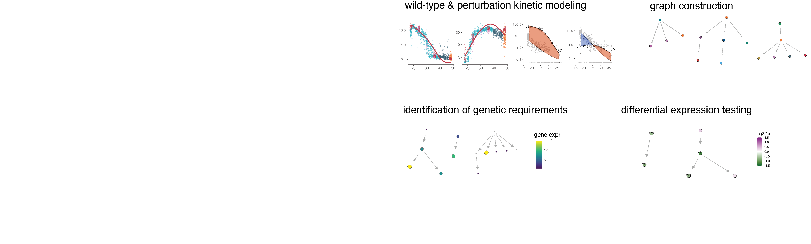

# Overview
        
Platt constitutes a bioinformatic toolkit for assembling maps of genetic requirements and lineage dependencies. It works together with [Hooke](https://cole-trapnell-lab.github.io/hooke/) to compare perturbations to one another and controls in order to phenotype specimens, identify cell types and genes central to those phenotypes, and learn how cells depend on genes and on one another. 

