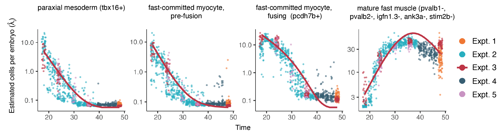
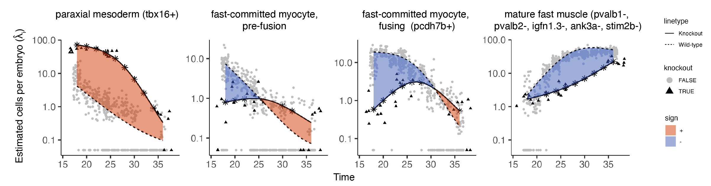

# Analyzing time series perturbation data with Platt

Platt can be used to analyze data with multiple time points across perturbations, such as the data found in 
[Saunders, Srivatsan, et al. Nature, in press (2023)](https://www.nature.com/articles/s41586-023-06720-2). 
This study in includes ~3 million single cells across almost 2000 individual barcoded embryos. 
It includes 19 timepoints (18-96 hpf) and 23 genetic loss of function experiments. 
_For more information about this dataset, see the [ZSCAPE website](https://cole-trapnell-lab.github.io/zscape/)._


# Analysis of skeletal muscle with Platt

This vignette focuses on the skeletal muscle subset. Platt wraps some base Hooke functions to more easily fit kinetic models.  
_You can see our Hooke kinetics tutorial [here.](https://cole-trapnell-lab.github.io/hooke/advanced/)_

The function `fit_wt_model` fits a Hooke model over time. It requires the following inputs: 

* cds - a monocle3 cell_data_set object
* sample_group - a column in colData(cds) that specifies how cells are grouped into samples
* cell_group - a column in colData(cds) that specifies how cells are grouped into types or states (e.g. cluster)
* perturbation_col - column name of the perturbation ids
* ctrl_ids - a list of control ids. These will be collapsed as a single control. 

`fit_wt_model()` subsets `cds` down to just the cells matching `ctrl_ids`, then fits a per-cell-type abundance trajectory over the timepoints found in `interval_col`, returning a Hooke `cell_count_model` (`ccm`) you can predict from or plot. Two defaults worth knowing about: `num_time_breaks` (default `4`) sets how many spline knots the trajectory gets across the time course — more breaks let the curve bend more, at the cost of needing more data to fit reliably — and `nuisance_model_formula_str` (default `"~1"`) is where you'd regress out covariates like batch before estimating the trajectory.

```
muscle_wt_ccm = fit_wt_model(skeletal_muscle_cds, 
                             sample_group = "embryo", 
                             cell_group = "cell_type", 
                             perturbation_col = "perturbation", 
                             ctrl_ids = c("ctrl-inj"))
                             
```

The function`plot_cell_type_control_kinetics()` allows you to view when cell types are at
their peak abundance in the data set. It requires the following inputs: 

* `wt_ccm` - a Hooke `cell_count_model` object (output of `fit_wt_model`)
* `start_time` - start of time interval
* `stop_time` - end of time interval
* `new_data` - tibble of covariates to predict on
* `color_points_by` - how to color counts
* `raw_counts` - whether to use raw counts of conditionally predicted counts

The plot overlays two things per cell type: the fitted abundance curve predicted from `wt_ccm` (one line, conditioned on whatever covariates you pass in `newdata` — e.g. `expt = "GAP16"` selects that experiment's line), and the raw observed counts as points, colored by whatever column you pass to `color_points_by` (here, `"expt"`, so you can see how individual experiments scatter around the fitted line even though the line itself was only predicted for one of them). `raw_counts = FALSE` (the default) plots counts adjusted by the fitted PLN model for the other covariates in `newdata`, rather than the literal size-factor-normalized counts — set it to `TRUE` if you want the raw per-sample counts instead of the model's covariate-adjusted estimate.

```
plot_cell_type_control_kinetics(muscle_wt_ccm, 
                                start_time = 18, 
                                stop_time = 48, 
                                newdata = tibble(expt = "GAP16"),
                                color_points_by = "expt",
                                raw_counts = F)

```


# Plotting perturbation kinetics

The function `fit_mt_models()` fits a kinetic model over time and perturbation. It requires the following inputs: 

* cds - a monocle3 cell_data_set object
* sample_group - a column in colData(cds) that specifies how cells are grouped into samples
* cell_group - a column in colData(cds) that specifies how cells are grouped into types or states (e.g. cluster)
* perturbation_col - column name of the perturbation ids
* ctrl_ids - a list of control ids. These will be collapsed as a single control. 

Note the `cds` here — `skeletal_muscle_comb_cds` — is a **combined** dataset containing both control and perturbation embryos together, unlike `fit_wt_model()`'s control-only input above. `fit_mt_models()` fits one genotype-level model per non-control perturbation it finds (or just the ones named in `mt_ids`, as below), with each model built to predict both the wild-type and knockout trajectories from that same combined fit — which is how `plot_cell_type_perturb_kinetics()` below can plot "against the wild type" without being handed a separate wild-type model.

`fit_mt_models()` returns a tibble, not a single `cell_count_model` — one row per perturbation, with the fitted model nested in a `perturb_ccm` column. Since `mt_ids` here has a single perturbation, pull that one model out before plotting:

```
skeletal_muscle_comb_cds = load_monocle_objects("~/OneDrive/UW/Trapnell/hooke_manuscript/R_objects/partition_skeletal_ref_gap16_cds_v2.1.0/")

tbx16_msgn1_tbl = fit_mt_models(skeletal_muscle_comb_cds, 
                                sample_group = "embryo", 
                                cell_group = "cell_type", 
                                perturbation_col = "perturbation", 
                                ctrl_ids = c("ctrl-inj"), 
                                mt_ids = c("tbx16-msgn1"))

tbx16_msgn1_ccm = tbx16_msgn1_tbl$perturb_ccm[[1]]

```

The function`plot_cell_type_perturb_kinetics()` plots a given perturbation's kinetics against the wild type. 
It requires the following inputs: 

* `mt_ccm` - a Hooke `cell_count_model` object (output of `fit_mt_model`)
* `start_time` - start of time interval
* `stop_time` - end of time interval
* `new_data` - tibble of covariates to predict on
* `color_points_by` - how to color counts
* `raw_counts` - whether to use raw counts of conditionally predicted counts

Internally, this predicts the same model's abundance curve twice from `newdata` — once with a `knockout = FALSE` covariate and once with `knockout = TRUE` — and plots both, which is why no separate control model needs to be supplied by default. If you do want to compare against a different, separately-fit wild-type model, `plot_cell_type_perturb_kinetics()` also accepts a `control_ccm` argument (it defaults to the same perturbation model).

```
plot_cell_type_perturb_kinetics(tbx16_msgn1_ccm, 
                                newdata = tibble("expt"= "GAP16"), 
                                raw_counts = F) + 
                                xlab("time")
```



_Next: see [Graphs](https://cole-trapnell-lab.github.io/platt/graphs/) to assemble these cell states into a lineage graph._