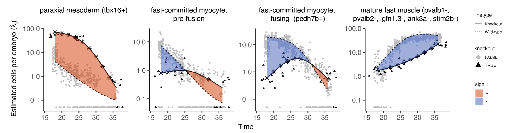

# Analyzing time series perturbation data with Platt

Platt can be used to analyze data with multiple time points across perturbations, such as the data found in 
[Saunders, Srivatsan, et al. Nature, in press (2023)](https://www.nature.com/articles/s41586-023-06720-2). 
This study in includes ~3 million single cells across almost 2000 individual barcoded embryos. 
It includes 19 timepoints (18-96 hpf) and 23 genetic loss of function experiments. 
_For more information about this dataset, see the [ZSCAPE website](https://cole-trapnell-lab.github.io/zscape/)._


# Analysis of skeletal muscle with Platt

This vignette focuses on the skeletal muscle subset. Platt wraps some base Hooke functions to more easily fit kinetic models.  
_You can see our Hooke kinetics tutorial [here.](https://cole-trapnell-lab.github.io/hooke/advanced/)_

The function `fit_wt_model` fits a Hooke model over time. It requires the following inputs: 

* cds - a monocle3 cell_data_set object
* sample_group - a column in colData(cds) that specifies how cells are grouped into samples
* cell_group - a column in colData(cds) that specifies how cells are grouped into types or states (e.g. cluster)
* perturbation_col - column name of the perturbation ids
* ctrl_ids - a list of control ids. These will be collapsed as a single control. 

```
muscle_wt_ccm = fit_wt_model(skeletal_muscle_cds, 
                             sample_group = "embryo", 
                             cell_group = "cell_type", 
                             perturbation_col = "perturbation", 
                             ctrl_ids = c("ctrl-inj"))
                             
```

The function`plot_cell_type_control_kinetics()` allows you to view when cell types are at
their peak abundance in the data set. It requires the following inputs: 

* `wt_ccm` - a Hooke `cell_count_model` object (output of `fit_wt_model`)
* `start_time` - start of time interval
* `stop_time` - end of time interval
* `new_data` - tibble of covariates to predict on
* `color_points_by` - how to color counts
* `raw_counts` - whether to use raw counts of conditionally predicted counts

```
plot_cell_type_control_kinetics(muscle_wt_ccm, 
                                start_time = 18, 
                                stop_time = 48, 
                                newdata = tibble(expt = "GAP16"),
                                color_points_by = "expt",
                                raw_counts = F)

```


# Plotting perturbation kinetics

The function `fit_mt_models()` fits a kinetic model over time and perturbation. It requires the following inputs: 

* cds - a monocle3 cell_data_set object
* sample_group - a column in colData(cds) that specifies how cells are grouped into samples
* cell_group - a column in colData(cds) that specifies how cells are grouped into types or states (e.g. cluster)
* perturbation_col - column name of the perturbation ids
* ctrl_ids - a list of control ids. These will be collapsed as a single control. 


```
skeletal_muscle_comb_cds = load_monocle_objects("~/OneDrive/UW/Trapnell/hooke_manuscript/R_objects/partition_skeletal_ref_gap16_cds_v2.1.0/")

tbx16_msgn1_ccm = fit_mt_models(skeletal_muscle_comb_cds, 
                                sample_group = "embryo", 
                                cell_group = "cell_type", 
                                perturbation_col = "perturbation", 
                                ctrl_ids = c("ctrl-inj"), 
                                mt_ids = c("tbx16-msgn1"))


```

The function`plot_cell_type_perturb_kinetics()` plots a given perturbation's kinetics against the wild type. 
It requires the following inputs: 

* `mt_ccm` - a Hooke `cell_count_model` object (output of `fit_mt_model`)
* `start_time` - start of time interval
* `stop_time` - end of time interval
* `new_data` - tibble of covariates to predict on
* `color_points_by` - how to color counts
* `raw_counts` - whether to use raw counts of conditionally predicted counts


```
plot_cell_type_perturb_kinetics(tbx16_msgn1_ccm, 
                                newdata = tibble("expt"= "GAP16"), 
                                raw_counts = F) + 
                                xlab("time")
```

