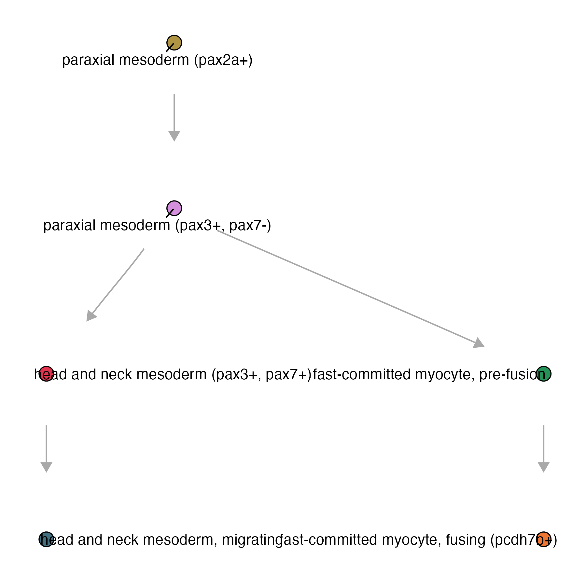
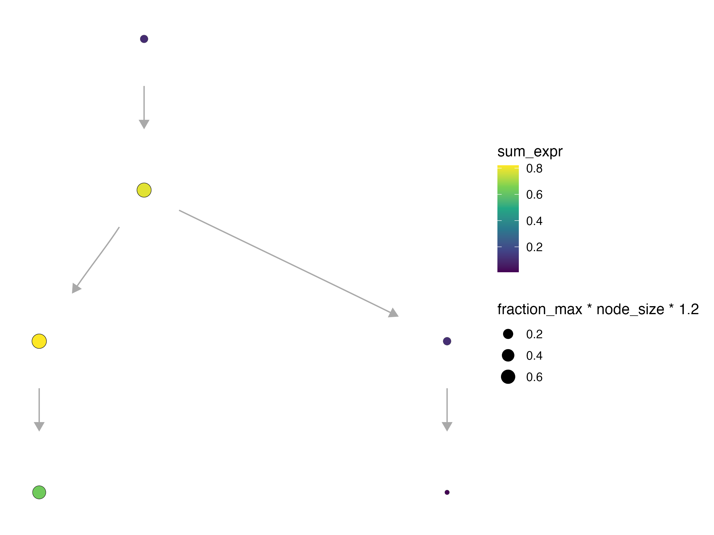
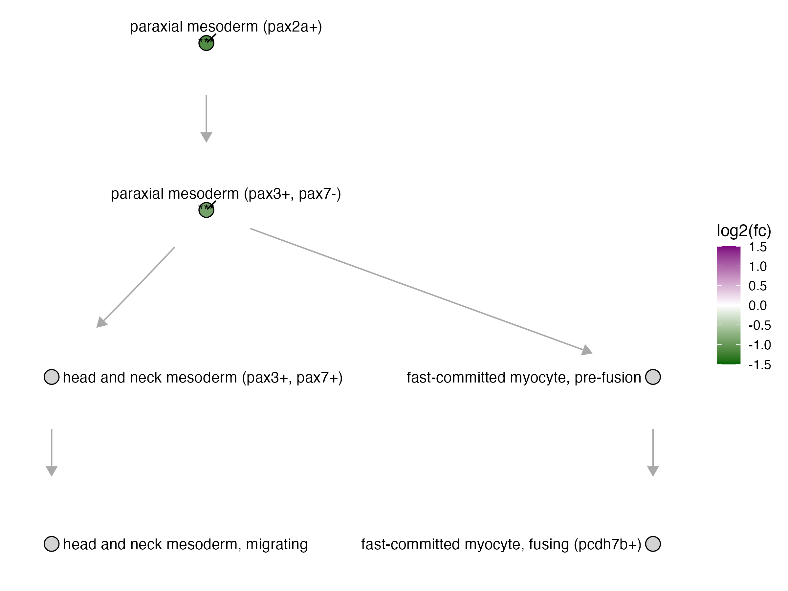
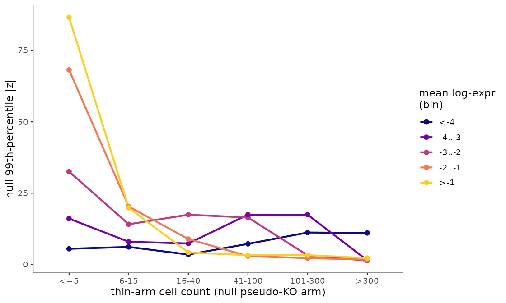
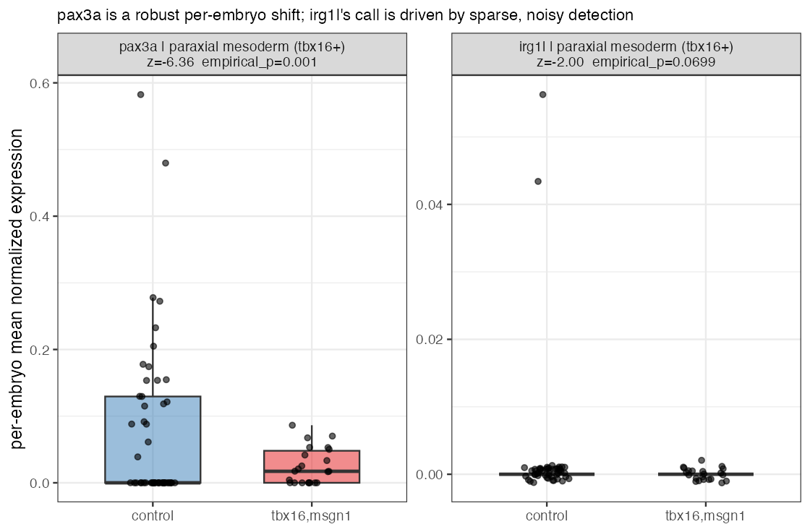
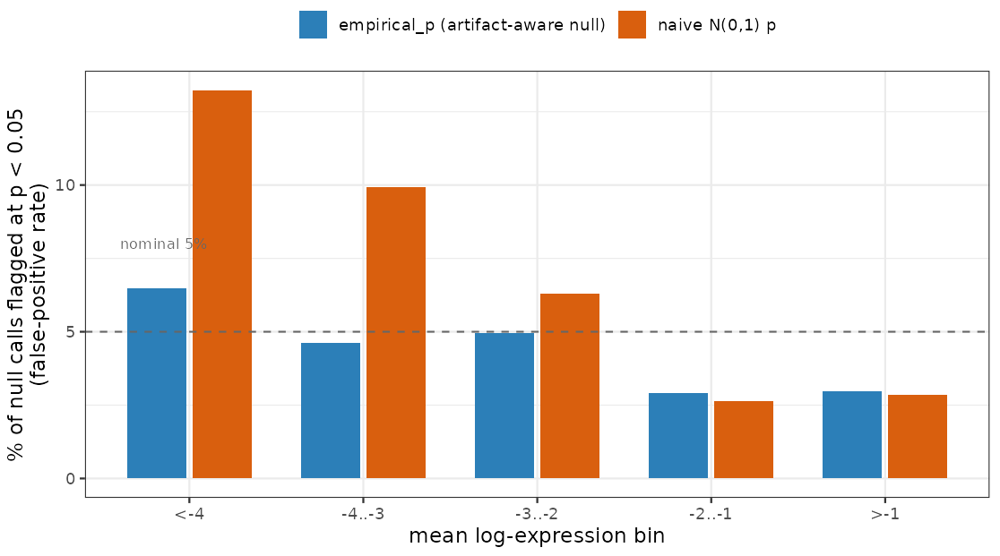

# Perturbation DEGs in Platt

## Running DEGs within each perturbation

The function `compare_genes_within_state_graph()`: 

* `ccs`- a Hooke `cell_count_set` object
* `perturbation_col` - column name of the perturbations
* `control_ids` - list of control ids 
* `cell_groups` - subset of cell groups to run DEGs on 
* `perturbations` - defaults to perturbation
* `cores`

For this example we will be using a subset of the skeletal muscle, for which we have 510,093 reference cells: 

```
platt:::plot_annotations(muscle_state_graph, plot_labels = T, node_size = 4)

```
{width=75%}


```
genes_within_cell_state = compare_genes_within_state_graph(ccs, 
                                                           perturbation_col = "gene_target", 
                                                           control_ids = c("ctrl-inj"), 
                                                           perturbations = c("tbx16", "tbx16-msgn1", "tbx16-tbx16l"),
                                                           cores = 6)
                                                           
genes_within_cell_state %>% head()

```

| cell_group                               | genes_within_cell_group | 
|------------------------------------------|-------------------------|
| paraxial mesoderm (tbx16+)               | `<tibble [13,322 × 40]>`  | 
| paraxial mesoderm (pax3+, pax7-)         | `<tibble [9,150 × 40]>`  | 
| fast-committed myocyte, pre-fusion       | `<tibble [7,051 × 40]>`  |
| fast-committed myocyte, fusing (pcdh7b+) | `<tibble [9,436 × 40]>`  |
| head and neck mesoderm (pax3+, pax7+)    | `<tibble [5,202 × 40]>`  |
| head and neck mesoderm, migrating        | `<tibble [10,447 × 40]>`  |

_Row counts differ per cell type because they reflect the number of genes admitted for that cell state (after expression filtering), not a fixed panel size. The table now also carries the empirical-FDR columns described below, alongside the original per-contrast statistics — hence the wider `40`-column tibble._

The results are nested by cell type. To look at a specific knockout term, you can unnest the dataframe and filter: 

```
genes_within_cell_state = genes_within_cell_state %>% tidyr::unnest(genes_within_cell_group)
genes_within_cell_state %>% filter(term == "tbx16,msgn1") %>% tidyr::unnest(perturb_effects)

```

| term       | cell_group                     | id                  | gene_short_name | perturb_to_ctrl_shrunken_lfc | empirical_p | empirical_fdr |
|------------|---------------------------------|----------------------|-----------------|-----------------------------|-------------|---------------|
| tbx16,msgn1 | paraxial mesoderm (tbx16+)     | ENSDARG00000000189   | sema6e            | -0.514                | 0.001                | 0.053 |
| tbx16,msgn1 | paraxial mesoderm (tbx16+)     | ENSDARG00000007369   | tcf7l1b           | -0.283                | 0.015                | 0.135 |
| tbx16,msgn1 | paraxial mesoderm (tbx16+)     | ENSDARG00000026845   | rhoaa             | -0.316                | 0.065                | 0.451 |
| tbx16,msgn1 | paraxial mesoderm (tbx16+)     | ENSDARG00000078748   | si:ch211-137a8.4  | -0.372                | 0.128                | 0.608 |
| tbx16,msgn1 | paraxial mesoderm (tbx16+)     | ENSDARG00000062646   | tet3              | -0.200                | 0.183                | 0.608 |
| tbx16,msgn1 | paraxial mesoderm (tbx16+)     | ENSDARG00000060002   | ogg1              | 0.304                 | 0.327                | 0.608 |

_(chosen to show a spread across `empirical_p`, rather than the literal first rows in file order; showing a subset of columns — the full table also carries `mean_log_sf`, `ctrl_log_sf`, `detected_genes`, `ctrl_detected_genes`, `perturb_to_ctrl_raw_lfc`, `perturb_to_ctrl_p_value`, `log_mean_expression`, `effect_skew`, `coefficient_mode`, and the arm-support columns discussed below)_

_Pax3a_ is a MLP gene observed in paraxial mesoderm progenitors as they commit to either head and neck mesoderm or fast muscle fates. 

```
plot_gene_expr(muscle_state_graph, genes = c("pax3a"), node_size = 4, plot_labels = F) + 
  theme(legend.position = "right")
```

{width=75%}


In the tbx16-msgn1 crispants, all of which fail to generate skeletal muscle properly, _pax3a_, 
a key regulator of myogenesis was differentially expressed in myogenic progenitors. 


| term         | cell_group                          | gene_short_name | perturb_to_ctrl_shrunken_lfc | perturb_to_ctrl_p_value | empirical_fdr |
|-------------|-------------------------------------|----------------|------------------------------|-------------------------|---------------|
| tbx16,msgn1 | paraxial mesoderm (tbx16+)         | pax3a          | -1.1899                   | 6.84e-09           | 0.053 |
| tbx16,msgn1 | paraxial mesoderm (pax3+, pax7-)  | pax3a          | -0.7007                   | 4.62e-04           | 0.191 |


... we can plot the DEG fold change of _pax3a_ in the tbx16-msgn1 mutant on the platt graph: 

```
plot_degs(muscle_state_graph, tbx16_degs %>% 
            filter(term == "tbx16,msgn1", gene_short_name == "pax3a"), node_size = 4.5)
```

{width=75%}

_For more information about plotting on a Platt graph, see our [plotting page](https://cole-trapnell-lab.github.io/platt/plotting)._

_For the reference (wild-type) side of DEG calling — pattern classification over the graph, terminal-selector/MLP genes — see our [Reference DEGs page](https://cole-trapnell-lab.github.io/platt/wt_degs/)._

## Filtering artifact calls with empirical FDR

Most of our perturbation screens are **control-heavy**: many more control embryos than knockout embryos per gene target. That asymmetry has a side effect on `perturb_to_ctrl_p_value` — for a lowly-expressed gene, the deep control arm can detect a transcript that the shallow perturbation arm simply misses by chance, which the model reads as a significant "down" call. It looks exactly like a real loss of expression, but it's a sampling artifact of how much data each arm has, not biology.

Diagnosing this under the null (no real perturbation effect) shows the artifact tracks **contrast imbalance**, not low expression on its own — it's specifically low-expression genes *combined with* a control-heavy design that inflate the false "down" call rate:

{width=90%}

_**Figure: the artifact tracks arm thinness, not expression level.** Under a control-split null (no real perturbation effect), the 99th-percentile of `|z|` is plotted against how many cells the pseudo-knockout arm has, split by mean expression bin. When the arm is thin (`<=5` cells), the higher-expression bins (orange, yellow) show wildly inflated null tails, while the lowest-expression bin (`<-4`, dark blue) stays flat and low across every arm size. If the artifact were simply about low expression, that dark blue line would be the one spiking — instead it's the flattest of all. The inflation is a sampling artifact of how few cells define the arm, not a consequence of how lowly a gene is expressed._

`annotate_empirical_fdr()` estimates how often that artifact happens and decorates a within-state DEG table with the answer, without needing to refit or permute anything:

* `deg_tbl` - a within-state DEG table (needs `cell_group`, `log_mean_expression`, `perturb_to_ctrl_p_value`, `perturb_to_ctrl_shrunken_lfc`)
* `abundances` - optional per-cell-type cell counts to stratify the null; falls back to a depth proxy from `mean_log_sf` if omitted
* `unaffected_cell_types` - optional list of cell types known to have no real perturbation effect, used to estimate the artifact rate; if omitted, the least-called cell types in each abundance stratum are used instead
* `sig_thresh` - significance threshold defining a "call" (default `0.05`)

The idea: within each (cell type x expression x direction) stratum, the rate of "down" calls in cell types that shouldn't be affected by the perturbation at all is the artifact rate. Comparing that self-null rate against the observed call rate in a cell type you do care about gives `empirical_fdr` — the estimated fraction of calls in that stratum that are artifacts rather than real biology:

```
genes_within_cell_state = annotate_empirical_fdr(genes_within_cell_state)
```

_Note: this simpler, self-contained version only returns the rate-based `empirical_fdr` — no per-gene `empirical_p`. The DEG tables above already carry a richer `empirical_p` (alongside `empirical_fdr`) computed by the pipeline's fuller, arm-size-conditioned model — see [Training the full empirical-FDR model](#training-the-full-empirical-fdr-model) below._

**In practice, `empirical_p` is what you should filter on.** It's built to be a drop-in, artifact-aware replacement for `perturb_to_ctrl_p_value`: `empirical_p = max(p_ashr, p_tail)`, so it can only push a call's significance *down*, never up — a call that's real by both the ordinary test and the artifact-null stays significant, while a call that only looks significant because of the low-expression/control-heavy artifact gets demoted back above the threshold. Compare the two _pax3a_ calls from the table above against a borderline, low-expression call in the same cell type:

| gene_short_name | cell_group                  | log_mean_expression | perturb_to_ctrl_shrunken_lfc | perturb_to_ctrl_p_value | empirical_p | empirical_fdr |
|-----------------|------------------------------|----------------------|-------------------------------|--------------------------|-------------|---------------|
| pax3a           | paraxial mesoderm (tbx16+)   | -1.88                | -1.190                        | 6.8e-09                  | 0.001       | 0.053         |
| irg1l           | paraxial mesoderm (tbx16+)   | -5.20                | -1.785                        | 0.049                    | 0.070       | 0.363         |

Both are called "down" at the ordinary `perturb_to_ctrl_p_value < 0.05`, and _irg1l_'s fold change even looks bigger — but it's a much more lowly-expressed gene sitting right at the significance cutoff. Once the artifact-aware test demotes it, `empirical_p` rises to `0.070` — no longer significant at `0.05` — while _pax3a_ stays at `empirical_p = 0.001`, comfortably real. In practice, you'd filter on `empirical_p` (e.g. `dplyr::filter(empirical_p < 0.05)`) in place of `perturb_to_ctrl_p_value`, alongside your usual fold-change threshold.

The per-embryo data behind these two calls makes the difference obvious: _pax3a_ is down across most embryos, a broad and consistent shift, while _irg1l_ sits at essentially zero in nearly every embryo in **both** groups — the "significant" naive call is being driven by two control embryos that just happen to detect it at all. That's the on-in-control artifact from the mechanism figure above, made concrete:

{width=90%}

**What `empirical_fdr` means here** is a different thing from `empirical_p`, and worth being precise about since the column name is reused for two different computations on this page: for `annotate_empirical_fdr()` above, `empirical_fdr` was the raw rate-based quantity (null-stratum call rate ÷ observed call rate). Here, in the model-based tables, `empirical_fdr` is a **Benjamini-Hochberg-adjusted q-value computed from `empirical_p`, within each `cell_group`** — the usual multiple-testing correction, just built on top of the artifact-aware p-value instead of the raw one. So `empirical_p < 0.05` asks "is this one gene's call real, artifact-adjusted?", while `empirical_fdr < 0.1` asks "if I call every gene in this cell type below this threshold, what fraction of that whole called set is expected to be false?" — the standard per-gene-test vs. whole-list-error-rate distinction. _pax3a_'s `empirical_fdr = 0.053` says: among all genes called at that same stringency in that cell type, ~5% are expected to be false — reassuring at the list level, not just the single-gene level.

The correction is worth trusting because it's calibrated: held out against a control-split null (no real perturbation effect), the ordinary p-value's false-positive rate balloons at low expression, while `empirical_p` stays close to the nominal 5% across the board.

{width=90%}

_**Figure: `empirical_p` restores nominal calibration; the naive test doesn't.** Held out against a control-split null (log-ratio = -2.48, the most control-heavy grid point), the naive `N(0,1)` p-value's false-positive rate at `p < 0.05` (orange) balloons well past the nominal 5% line at low expression — over 13% in the most lowly-expressed bin. `empirical_p` (blue) stays close to the nominal 5% across every expression bin, including the ones where the naive test breaks down._

### Training the full empirical-FDR model

`empirical_p` comes from a fuller model than `annotate_empirical_fdr()` runs — one that's trained from your own experiment's control cells rather than assumed. It's a four-step pipeline:

**1. Arm support** — how many replicate embryos and cells each cell type actually has on the perturbation side, which sets the honest degrees-of-freedom for the contrast:

```
support = efdr_perturbation_support(tbx16_msgn1_cds,
                                    sample_group = "embryo",
                                    cell_group = "cell_type",
                                    control_ids = c("ctrl-inj"),
                                    perturbation_col = "gene_target")
```

**2. Build the null** — relabel *control* embryos as a pseudo-perturbation at several split sizes, and run the same within-state DEG contrast on them. Since there's no real effect in a control-vs-control split, whatever "significant" calls fall out are exactly the artifact you're trying to model:

```
ctrl_only_cds = tbx16_msgn1_cds[, colData(tbx16_msgn1_cds)$gene_target %in% c("ctrl-inj")]

null_draws = build_empirical_null(ctrl_only_cds,
                                  sample_group = "embryo",
                                  cell_group = "cell_type",
                                  control_ids = c("ctrl-inj"),
                                  perturbation_col = "gene_target",
                                  cores = 6)
```

**3. Train the model** — fit the null tail of `|z|` as a surface over expression and thin-arm cell count:

```
efdr_model = train_efdr_model(null_draws)
```

**4. Annotate your real DEG table** — apply the trained model, along with the arm support from step 1, to get `empirical_p`/`empirical_fdr`:

```
genes_within_cell_state = annotate_empirical_fdr_model(
  model = efdr_model,
  deg_tbl = genes_within_cell_state,
  support = support,
  arm_cells = support
)
```

This is the same computation that produces the `empirical_p`/`empirical_fdr` columns already sitting in the pipeline-computed tables shown throughout this page — running it yourself only matters if you're annotating a DEG table computed outside the standard pipeline.

_A documentation gap worth knowing about: `build_empirical_null()`'s documented return columns (`cell_group`, `log_mean_expression`, `z`, `log_ratio`) don't list `n_pert_cells`, even though `train_efdr_model()`'s own docs say its `null` input needs one. If you hit a missing-column error wiring these two together, that's why — check the current source rather than assuming the docs above are complete._

_For the full argument list of each of these functions, see their reference pages: [`efdr_perturbation_support()`](https://cole-trapnell-lab.github.io/platt/reference/efdr_perturbation_support), [`build_empirical_null()`](https://cole-trapnell-lab.github.io/platt/reference/build_empirical_null), [`train_efdr_model()`](https://cole-trapnell-lab.github.io/platt/reference/train_efdr_model), and [`annotate_empirical_fdr_model()`](https://cole-trapnell-lab.github.io/platt/reference/annotate_empirical_fdr_model)._
