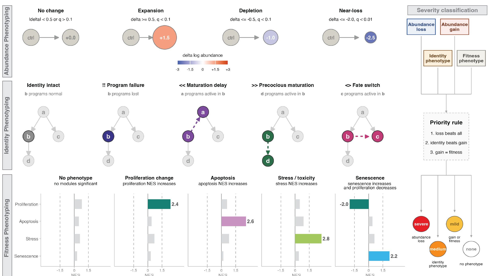

# Transcriptional phenotyping

Once we've computed DEGs for a perturbation, the natural next question is: what is the *phenotype*? Which cell states are genuinely required for a genotype, as opposed to just downstream casualties of some earlier loss? And beyond abundance — is a cell state still present, but not quite *itself* anymore (delayed, precocious, stressed, or partially misspecified)?

Platt's phenotyping functions turn these per-gene, per-cell-state statistics into calls that summarize an entire perturbation at a glance, and then draw those calls directly on the lineage graph. This replaces the older DvEG (deviantly-expressed genes) workflow, which compared perturbation DEGs against reference DEGs directly — transcriptional phenotyping folds that same question into a broader, graph-topology-aware view of a perturbation's phenotype.

{width=90%}

_For more information on DEGs, see our [Reference DEGs](https://cole-trapnell-lab.github.io/platt/wt_degs/) and [Perturbation DEGs](https://cole-trapnell-lab.github.io/platt/perturbation_degs/) pages._

## Categorizing genetic requirements

The first question to ask of a perturbation is which cell states are lost, and whether that loss is a *direct* requirement or an *indirect* consequence of losing an earlier state in the lineage. `categorize_genetic_requirements()` answers this using the state graph's topology: for each perturbation, it takes the cell states flagged as lost (`is_lost_when_present`) and looks at where they sit in the lineage. A lost cell state with no lost parent upstream of it in the graph is called **directly** lost; a lost cell state whose loss can be explained by an already-lost parent is called **indirectly** lost.

* `perturb_ccm_tbl` - a tibble of fitted genotype models, one row per perturbation, with a `perturb_summary_tbl` list-column (the per-cell-state loss summary, e.g. from a table of `fit_genotype_ccm()` results)
* `state_graph` - an `igraph` object describing the lineage relationships among cell states

```
genetic_requirements = categorize_genetic_requirements(perturb_ccm_tbl, muscle_state_graph@graph)

genetic_requirements %>% head()
```

| id                                  | perturb_name | perturb_effect |
|--------------------------------------|--------------|----------------|
| paraxial mesoderm (tbx16+)           | tbx16,msgn1  | direct         |
| fast-committed myocyte, pre-fusion   | tbx16,msgn1  | indirect       |
| fast-committed myocyte, fusing (pcdh7b+) | tbx16,msgn1 | indirect     |

In the tbx16-msgn1 crispant, paraxial mesoderm progenitors are directly required — they're lost with no lost parent upstream of them in the graph — while the fast muscle fates downstream are only indirectly lost, as a consequence of losing their progenitor pool.

## From impact calls to phenotype glyphs

Abundance loss is only one axis of a phenotype. A cell state can persist in normal numbers and still show a transcriptional identity defect (a maturation delay, a fate switch, a program failure) or fitness-related stress (apoptotic, senescent, or stress-pathway signatures). Platt represents this richer, per-cell-type summary as an **impact table** — one row per cell type, with categorical calls for abundance, identity, and fitness that are typically assembled upstream from your DEG/DvEG/abundance evidence for a genotype. At minimum, an impact table needs:

* `cell_type` - the cell state being annotated
* `abundance_code` - one of `"A0 No change"`, `"A1 Expansion"`, `"A2 Depletion"`, `"A3 Ablation/Loss"`, `"A4 Ectopic/extra state"`
* `abundance_severity` - `"none"`, `"mild"`, `"moderate"`, or `"severe"`
* `identity_label` - a call describing the transcriptional identity of the state (identity intact, maturation delay, precocious maturation, program failure, fate switch/misspecification, identity fragmentation)
* `fitness_label` - a free-text label capturing fitness-related evidence (e.g. mentioning apoptosis, stress, or senescence)

```
tbx16_impact_table = tibble::tibble(
  cell_type          = c("paraxial mesoderm (tbx16+)", 
                          "fast-committed myocyte, pre-fusion", 
                          "head and neck mesoderm (pax3+, pax7+)"),
  abundance_code     = c("A3 Ablation/Loss", "A2 Depletion", "A1 Expansion"),
  abundance_severity = c("severe", "moderate", "mild"),
  identity_label     = c("I0 Identity intact", "I3 Program failure within identity", "I0 Identity intact"),
  fitness_label      = c("F2 apoptosis", "none", "none")
)
```

`impact_to_phenos()` translates that impact table into the standardized fields the plotting layer expects — an abundance log2FC proxy (from `abundance_code` x `abundance_severity`), a compact identity code and glyph string (e.g. `"!!"` for program failure), and fitness axes for direction, apoptosis, stress score, and senescence:

* `impact_table` - the data frame described above
* `sev_map` - severity label -> magnitude, used to build the abundance proxy
* `abundance_code_map` - abundance code -> signed direction/magnitude
* `identity_glyph_map` - identity label -> glyph string

```
tbx16_phenos = impact_to_phenos(tbx16_impact_table)

tbx16_phenos %>% select(cell_group, abundance_code, abundance_log2fc, identity_glyph, F2_apoptosis)
```

You won't usually call `impact_to_phenos()` directly, though — `plot_phenotypes_from_impact()` calls it for you as its first step.

## Plotting phenotype calls on the graph

`plot_phenotypes_from_impact()` is the entrypoint you'll reach for most often: hand it your `cell_state_graph` and an impact table, and it converts the table with `impact_to_phenos()` and renders the annotated lineage graph in one call:

* `cell_state_graph` - a platt `cell_state_graph` object
* `impact_table` - the impact table described above
* `show_node_labels` - label the cell states
* `...` - additional arguments forwarded to `plot_phenotypes_glyphs()`

```
plot_phenotypes_from_impact(muscle_state_graph, 
                            tbx16_impact_table, 
                            show_node_labels = TRUE)
```

Each node's fill encodes the abundance call (expansion, depletion, or ablation/loss), and a short bold **glyph** is drawn on top of the node to encode the identity call — `""` for identity intact, `"<<"` for a maturation delay, `">>"` for precocious maturation, `"!!"` for a program failure within identity, `"<>"` for a fate switch or misspecification, and `"##"` for identity fragmentation. In the tbx16-msgn1 crispant above, paraxial mesoderm progenitors are lost outright, while the fast-committed myocytes that do persist show a program-failure glyph (`"!!"`) — consistent with the depleted _pax3a_ signal we saw on the [Perturbation DEGs page](https://cole-trapnell-lab.github.io/platt/perturbation_degs/).

If you want more control over the plot — for instance, restricting to a subset of cell types, or tuning label sizes — you can call `plot_phenotypes_glyphs()` directly on a table you've already run through `impact_to_phenos()`:

* `cell_state_graph` - a platt `cell_state_graph` object
* `phenos_df` - a phenotype table, typically from `impact_to_phenos()`
* `map` - a named list mapping the phenotype roles (`lfc`, `q`, `ident`, `glyph`, `f1`-`f4`) to columns in `phenos_df`
* `node_overlay` - `"glyphs"` (the default) to draw the identity glyphs on each node, or `"none"` to suppress them
* `cell_types` - restrict the plot to a subset of cell states
* `show_node_labels`

```
plot_phenotypes_glyphs(muscle_state_graph, 
                       tbx16_phenos, 
                       cell_types = c("paraxial mesoderm (tbx16+)", 
                                      "fast-committed myocyte, pre-fusion"),
                       show_node_labels = TRUE)
```

_For more information on plotting Platt graphs more generally, see our [plotting page](https://cole-trapnell-lab.github.io/platt/plotting)._
