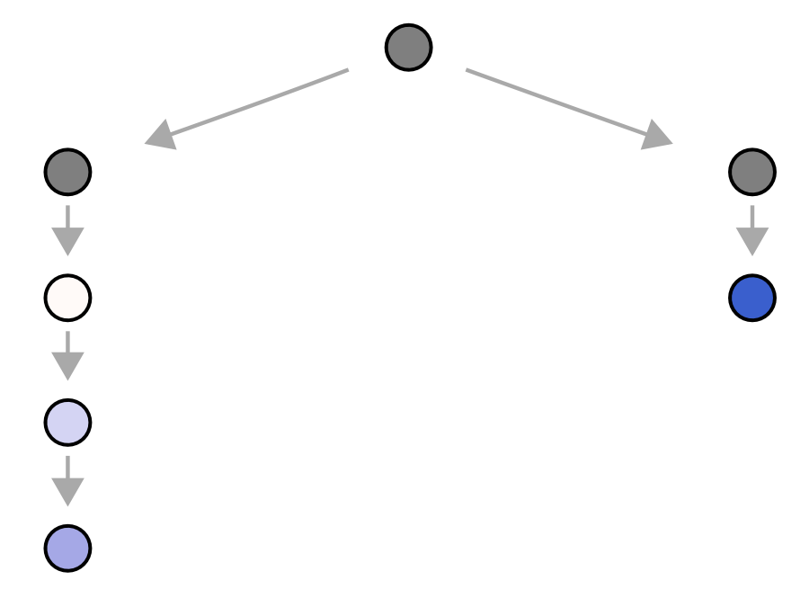
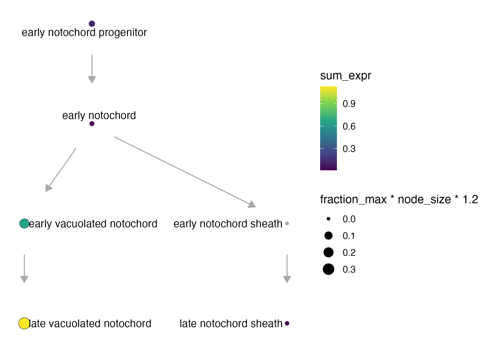
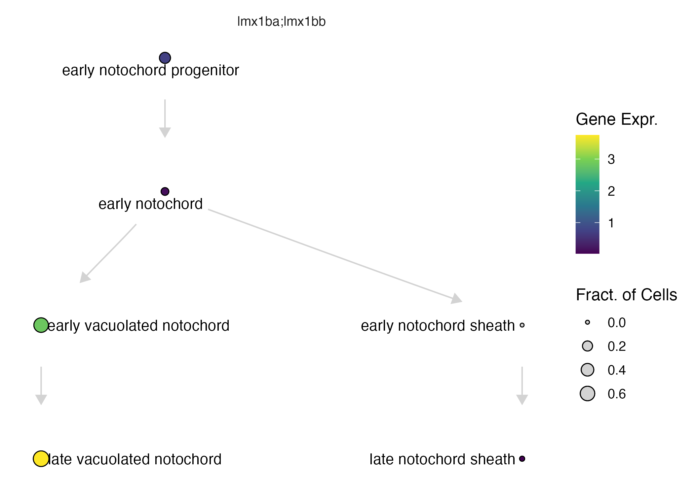
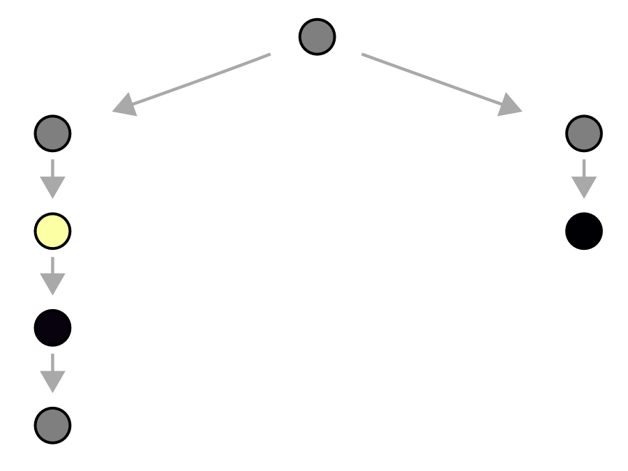

Platt's plotting functions all take the same starting point — a `cell_state_graph` — and layer a different kind of data on top of it: `plot_annotations()` draws the graph's own node/edge metadata, `plot_abundance_changes()` and `plot_degs()` color it by a differential-abundance or DEG table, and `plot_gene_expression()` colors it by raw expression. Because they share a layout, you can move between them on the same graph object without recomputing anything.

### Plotting a cell_state_graph

The function `plot_annotations()`: 

* `cell_state_graph` - the `cell_state_graph` object to plot
* `color_nodes_by` - which attribute to color nodes by
* `label_nodes_by` - which attribute to label nodes by

If you don't pass `color_nodes_by`/`label_nodes_by`, `plot_annotations()` doesn't just leave nodes uncolored — it falls back to whatever was stored on the `cell_state_graph` when it was created (`new_cell_state_graph(..., color_nodes_by = ...)`), and failing that, to the `cell_group` the underlying `cell_count_set` was built on. That's why the call below can omit them and still get sensibly-colored, sensibly-labeled nodes.

```
plot_annotations(notochord_state_graph, node_size = 4.5)
```

{width=75%}

The function `plot_abundance_changes()`:

* `cell_state_graph` - the `cell_state_graph` object to plot
* `comp_abund_table` - a Hooke differential-abundance comparison table, with a fold-change column and a significance column per cell state

`plot_abundance_changes()` colors each node by the fold-change column in `comp_abund_table` (limited to `fc_limits`, default `c(-3, 3)`) and, by default, scales node size by how significant that change is (`scale_node = TRUE`) — so a node that's both large and saturated in color is a strong, confident abundance change, while a small pale node is a weak or uncertain one. If `comp_abund_table` has multiple comparisons in it (e.g. several timepoints), use `facet_group` to lay them out as separate panels instead of filtering down to one first, as the example below does with `filter(timepoint_x==60)`.

_To see how to run Hooke to make a `comp_abund_table`, see our [differential abundance page](https://cole-trapnell-lab.github.io/hooke/about/)._


```
plot_abundance_changes(notochord_state_graph, lmx_fc %>% filter(timepoint_x==60),  node_size = 4.5)
```

{width=75%}

The function `plot_gene_expression()`: 

* `cell_state_graph` - the `cell_state_graph` object to plot
* `genes` - a list of genes to plot
* `aggregate` - whether to sum the genes in the genes list

With `aggregate = FALSE` (the default), each gene in `genes` gets its own node value, so plotting more than one gene at once is really plotting them side by side. `aggregate = TRUE` instead sums each state's mean expression across all the listed genes into a single combined value per node — useful for genes that act redundantly or are otherwise meant to be read as one signature, like `lmx1bb`/`lmx1ba` below. Two more parameters worth knowing about: `fract_expr`/`mean_expr` set the minimum fraction-expressing / mean-expression a gene needs to count as "expressed" in a state at all (both default to `0`), and `scale_to_range` min-max normalizes each gene's expression to `[0, 1]` before plotting — handy for putting genes with very different expression magnitudes on the same visual scale, but it's not compatible with `aggregate`.

```
plot_gene_expression(notochord_state_graph, genes=c("lmx1bb", "lmx1ba")) 
```




```
plot_gene_expression(notochord_state_graph, genes=c("lmx1bb", "lmx1ba"), aggregate = T) 
```
{width=75%}


The function `plot_degs`: 

* `cell_state_graph` - the `cell_state_graph` object to plot
* `deg_table` - a DEG table with per-cell-state log-fold-changes and p-values, e.g. from `compare_genes_over_graph()` or `compare_genes_within_state_graph()`

`plot_degs()` needs `deg_table` to carry log-fold-changes and p-values per cell state — exactly the shape `compare_genes_within_state_graph()`/`compare_genes_over_graph()` output — and colors each node by fold change, scaled to `fc_limits` (default `c(-3, 3)`; the example below tightens that to `c(-1, 1)` since _col2a1a_'s changes are more modest). If `deg_table` has more than one contrast in it (multiple `term`s, say), `facet_group` (default `"term"`) splits them into separate panels rather than overplotting them — the example below sidesteps that by filtering to a single gene first.

_To see how to run DEGs to make a deg_table, see our [Perturbation DEGs page](https://cole-trapnell-lab.github.io/platt/perturbation_degs/)._

```
plot_degs(notochord_state_graph, lmx1b_degs %>% filter(gene_short_name == "col2a1a"), node_size = 4.5, fc_limits = c(-1,1))
```

{width=75%}

_Next: see [Background](https://cole-trapnell-lab.github.io/platt/background/) for the statistical model underlying Platt, or jump straight to the [Reference](https://cole-trapnell-lab.github.io/platt/reference/) page for the complete function listing._


