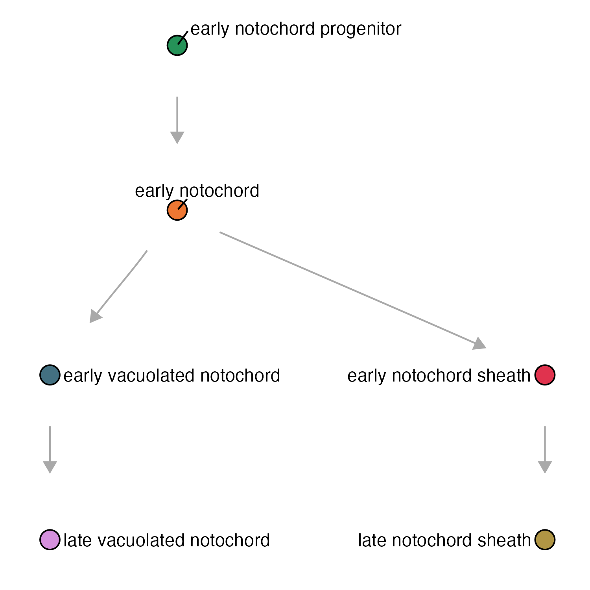
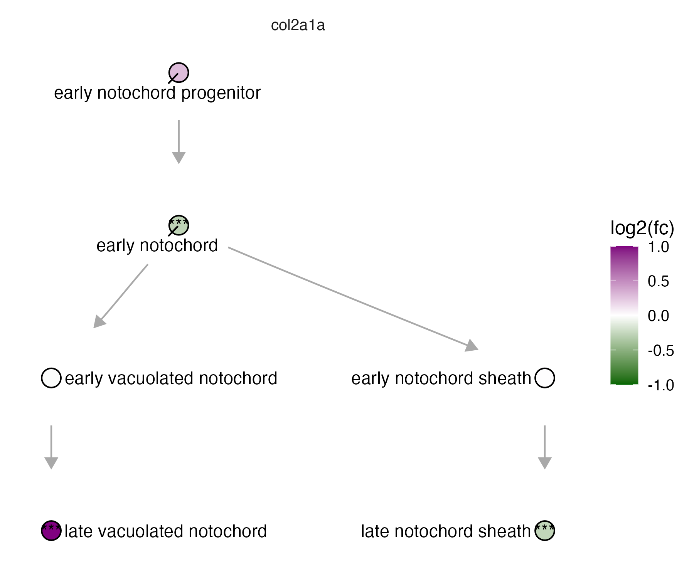

### Plotting a cell_state_graph

The function `plot_annotations()`: 

* `cell_state_graph`
* `color_nodes_by`
* `label_nodes_by`

```
plot_annotations(notochord_state_graph, node_size = 4.5)
```

{width=75%}

The function `plot_abundance_changes()`:

* `cell_state_graph`
* `comp_abund_table`

_To see how to run Hooke to make a `comp_abund_table`, see our [differential abundance page](https://cole-trapnell-lab.github.io/hooke/about/)._


```
plot_abundance_changes(notochord_state_graph, lmx_fc %>% filter(timepoint_x==60),  node_size = 4.5)
```

{width=75%}

The function `plot_gene_expr`: 

* `cell_state_graph`
* `genes`

```
plot_gene_expr(notochord_state_graph, genes=c("lmx1bb"))
```

{width=75%}


The function `plot_degs`: 

* `cell_state_graph`
* `deg_table`

_To see how to run DEGs to make a deg_table, see our [DEG page](https://cole-trapnell-lab.github.io/platt/deg/)._

```
plot_degs(notochord_state_graph, lmx1b_degs %>% filter(gene_short_name == "col2a1a"), node_size = 4.5)
```

{width=75%}


