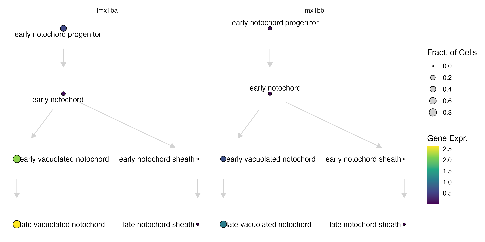

# Small graphs

```
pf_cds = load_monocle_objects("pec_fin_cds")
pf_graph = readRDS("pec_fin_graph.rds")
pf_ccs = new_cell_count_set(pf_cds, sample_group = "embryo", cell_group = "cell_type")
pf_state_graph = new_cell_state_graph(pf_graph, pf_ccs)

```

# Larger graphs
```
ref_cds = load_monocle_objects("")
ref_ccs = new_cell_count_set(cds, sample_group = "embryo", cell_group = "cell_type")

combined_state_graph = readRDS("")

ref_state_graph = new_cell_state_graph(combined_state_graph, 
                                       ref_ccs, 
                                       color_nodes_by = "projection_group",
                                       group_nodes_by="projection_group", 
                                       num_layers=3)

```


### Plotting a cell_state_graph

The function `plot_annotations()`: 
* `cell_state_graph`
* `color_nodes_by`
* `label_nodes_by`

```
plot_annotations(notochord_state_graph, node_size = 4.5)
```

{width=75%}

The function `plot_abundance_changes()`:

* `cell_state_graph`
* `comp_abund_table`

```
plot_abundance_changes(notochord_state_graph, lmx_fc %>% filter(timepoint_x==60),  node_size = 4.5)
```

{width=75%}

The function `plot_gene_expr`: 

* `cell_state_graph`
* `genes`

```
plot_gene_expr(notochord_state_graph, genes=c("lmx1bb"))
```

{width=75%}


The function `plot_degs`: 

* `cell_state_graph`
* `deg_table`

```
plot_degs(notochord_state_graph, num_degs, node_size = 4.5)
```

{width=75%}


