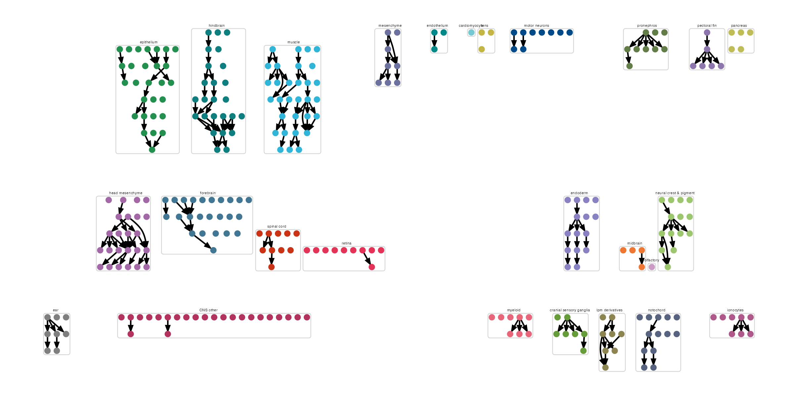

# Small graphs

```
pf_cds = load_monocle_objects("pec_fin_cds")
pf_graph = readRDS("pec_fin_graph.rds")
pf_ccs = new_cell_count_set(pf_cds, sample_group = "embryo", cell_group = "cell_type")
pf_state_graph = new_cell_state_graph(pf_graph, pf_ccs)

```

# Larger graphs
```
ref_cds = load_monocle_objects("")
ref_ccs = new_cell_count_set(cds, sample_group = "embryo", cell_group = "cell_type")

combined_state_graph = readRDS("")

ref_state_graph = new_cell_state_graph(combined_state_graph, 
                                       ref_ccs, 
                                       color_nodes_by = "projection_group",
                                       group_nodes_by="projection_group", 
                                       num_layers=3)

```


# Plot by annotations

```
plot_by_annotations(pf_state_graph, plot_labels = T, node_size=4) + theme(legend.position = "none")
```

```
plot_by_annotations(ref_state_graph) + theme(legend.position = "none")
```


# Plot by gene expression 

```
plot_by_gene_expr(pf_state_graph, genes= c("runx3"))
```

# Plot by abundance changes

```
plot_abundance_changes(pf_state_graph, 
                       perturb_table_at_peak_times, 
                       plot_labels = T, node_size = 4) 

```

# Plot by DEG change

```
plot_degs(pf_state_graph, 
          tbx16_degs %>% left_join(gene_df, by = "id") %>% filter(term == "tbx16,msgn1", gene_short_name == "pax3a"), 
          fc_limits = c(-1.5, 1.5),  
          node_size = 4

```

