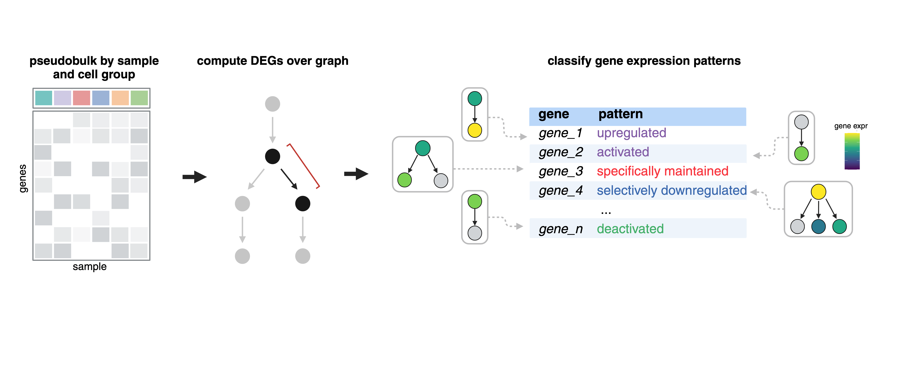
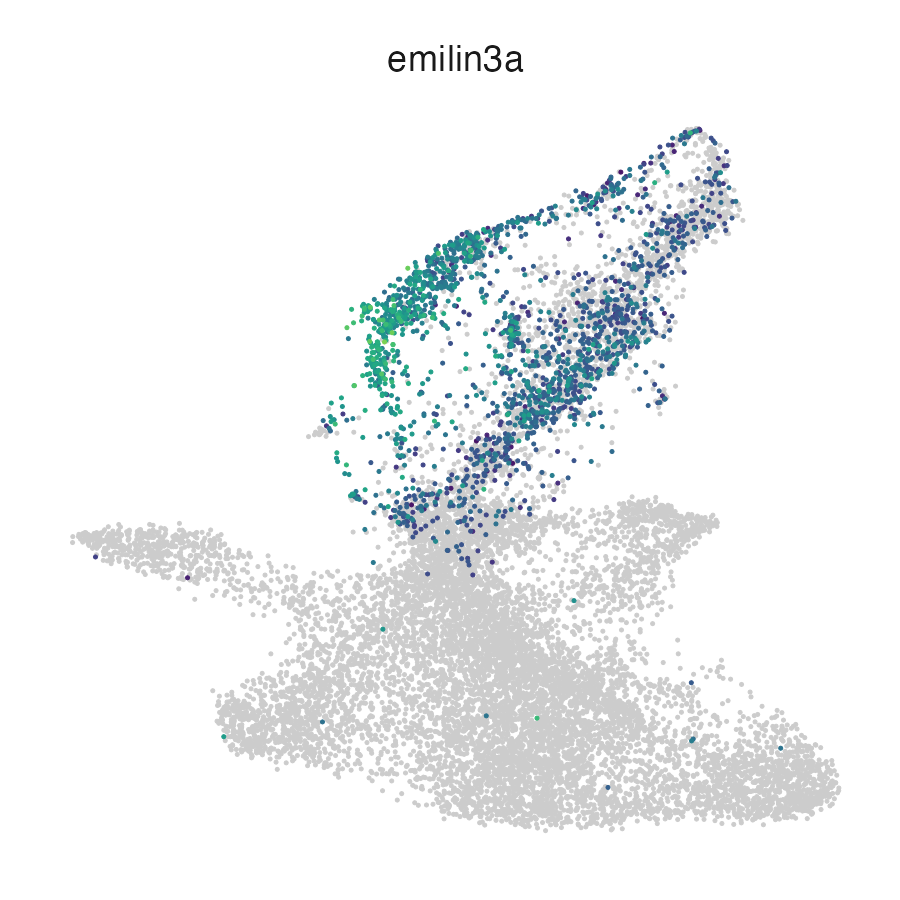
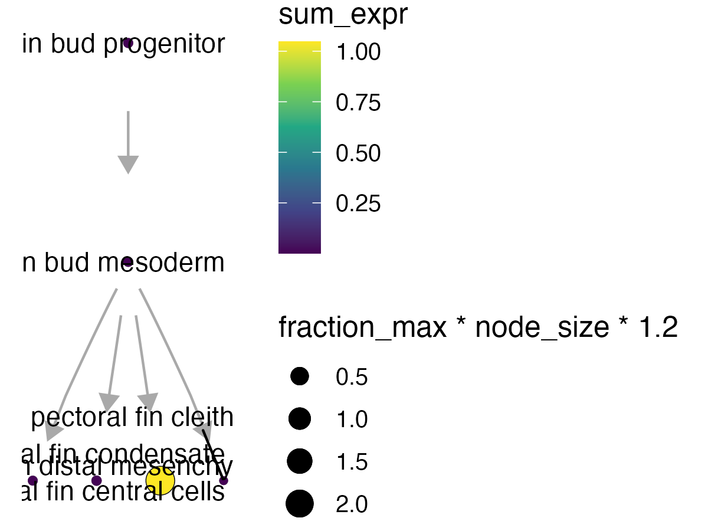
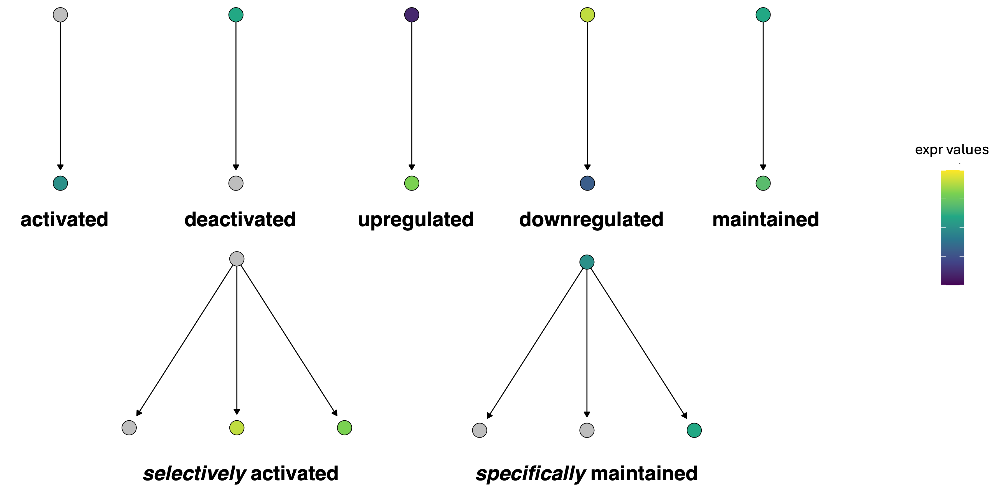

# Reference (wild-type) DEGs in Platt

## Running DEGs over a graph

Finding regulatory genes with fate-restricted patterns may help identify new genetic requirements of cell types. For example, “terminal selector” and “multilineage priming (MLP)” genes might activate specific fates, genes expressed in progenitors only might be required for maintaining the progenitor states, and genes excluded from certain fates might repress that fate [1-4](https://cole-trapnell-lab.github.io/platt/wt_degs/#references). We can systematically identify these patterns by computing differential expression across our graphs and then classify these patterns based on a set of defined rules.  



_See an explanation of gene patterns [below](#gene-expression-patterns):_

The function `compare_genes_over_graph()`:

* `ccs`- a Hooke `cell_count_set` object
* `graph` - an `igraph` object
* `gene_ids` - a list of genes to subset the analysis to 
* `cores` - number of cores 

Under the hood, every gene at every cell state is fit against its parent(s), children, and siblings (via `compare_genes_in_cell_state()`, below) and classified using three thresholds you can also override here: `log_fc_thresh` (how large a log-fold-change counts as a real difference, default `1`), `abs_expr_thresh` (the minimum expression level to call a gene "expressed" at all, default `1e-3`), and `sig_thresh` (the p-value cutoff for calling a comparison significant, default `0.05`). Those three thresholds are what ultimately decide whether a gene is called activated, maintained, excluded, and so on.

```
pf_graph_degs = compare_genes_over_graph(pf_ccs,
                                         pf_cell_state_graph@graph, 
                                         cores = 4)
```

`compare_genes_over_graph()` returns one row per cell state in the graph, with the classification results for every gene tested at that state nested into a `gene_class_scores` tibble:

| cell_state                     | gene_class_scores         |
|--------------------------------|---------------------------|
| pectoral fin condensate        | `<tibble [14,899 × 5]>`   |
| pectoral fin distal mesenchyme | `<tibble [14,899 × 5]>`   |
| pectoral fin central cells     | `<tibble [14,899 × 5]>`   |
| pectoral fin bud mesoderm      | `<tibble [14,899 × 5]>`   |
| pectoral fin cleithrum         | `<tibble [14,899 × 5]>`   |
| pectoral fin bud progenitor    | `<tibble [14,899 × 5]>`   |

To unnest the dataframe: 

```
pf_graph_degs %>% 
  tidyr::unnest(gene_class_scores) %>% 
  filter(pattern_activity_score > 1) %>%
  filter(interpretation == "Selectively activated")
  
```

| cell_state              | gene_id             | data    | interpretation       | pattern_activity_score | gene_short_name |
|-------------------------|---------------------|---------|----------------------|------------------------|-----------------|
| pectoral fin condensate | ENSDARG000000062…  | `<tibble>` | Selectively activated      | 1.02                   | ell2            |
| pectoral fin condensate | ENSDARG000000099…  | `<tibble>` | Selectively activated      | 2.16                   | slc38a5a        |
| pectoral fin condensate | ENSDARG000000106…  | `<tibble>` | Selectively activated      | 1.86                   | clic2           |
| pectoral fin condensate | ENSDARG000000116…  | `<tibble>` | Selectively activated      | 1.19                   | slc26a2         |
| pectoral fin condensate | ENSDARG000000124…  | `<tibble>` | Selectively activated      | 3.77                   | col11a2         |
| pectoral fin condensate | ENSDARG000000309…  | `<tibble>` | Selectively activated      | 2.00                   | mybl1           |

A few of these columns are worth calling out:

* `data` - the per-comparison statistics backing the call (log-fold-changes and p-values against the parent/children/siblings that were compared)
* `interpretation` - the pattern label assigned to this gene at this cell state; these are the same category names defined in [Gene expression patterns](#gene-expression-patterns) below
* `pattern_activity_score` - a magnitude for how strongly the pattern holds (e.g. for an "activated" call, how much higher expression is in this state than in its parent) — bigger isn't just "more significant," it's "more pronounced," which is why the example above filters on both `pattern_activity_score > 1` and a specific `interpretation`

We can check some of these markers by plotting them either in the UMAP space:

```
plot_cells(pf_ccs@cds, genes = c("emilin3a"))
```

{width=50%}

... or on our platt graph:

```
plot_gene_expression(pf_cell_state_graph, genes = c("emilin3a"))
```

{width=75%}

_For more information about plotting on a Platt graph, see our [plotting page](https://cole-trapnell-lab.github.io/platt/plotting)._

## Comparing genes in a single cell state

`compare_genes_over_graph()` classifies every cell state in the graph by calling `compare_genes_in_cell_state()` once per node — it looks up that node's parents, children, and siblings in the `state_graph`, and compares expression at the node to each of those neighbors to decide whether a gene looks selectively activated, restricted to progenitors, excluded from a fate, and so on.

Because `compare_genes_in_cell_state()` needs the coefficient matrices that `compare_genes_over_graph()` fits across the whole graph (via the `collect_coefficients_for_shrinkage()` helper), most users will never call it directly — you get its output for free from `compare_genes_over_graph()`. Reach for it yourself if you already have `estimate_matrix`/`stderr_matrix` in hand (for example, kept around from a prior model fit) and want to re-examine or reclassify a single cell state — say, with a different `log_fc_thresh` or `sig_thresh` — without refitting every gene model in the graph:

* `cell_state` - the cell state to classify
* `state_graph` - an `igraph` object
* `estimate_matrix` - matrix of per-cell-state coefficient estimates (genes x cell states)
* `stderr_matrix` - matrix of per-cell-state standard errors, same shape as `estimate_matrix`
* `n` - number of pseudobulk samples the models were fit on
* `log_fc_thresh`, `abs_expr_thresh`, `sig_thresh` - same thresholds as `compare_genes_over_graph()`

```
pb_cds = hooke:::pseudobulk_ccs_for_states(pf_ccs, cell_agg_fun = "sum")

pb_models = monocle3::fit_models(pb_cds, model_formula_str = "~ 0 + cell_group", cores = 4) %>%
  dplyr::select(gene_short_name, id, model, model_summary, status)

pb_coeffs = collect_coefficients_for_shrinkage(pb_cds, pb_models, 
                                                       abs_expr_thresh = 1e-3, 
                                                       term_to_keep = "cell_group")

condensate_genes = compare_genes_in_cell_state(cell_state = "pectoral fin condensate",
                                               state_graph = pf_cell_state_graph@graph,
                                               estimate_matrix = pb_coeffs$coefficients,
                                               stderr_matrix = pb_coeffs$stdev.unscaled,
                                               n = ncol(pb_cds))
```

`condensate_genes` is a single-cell-state slice of the same `gene_class_scores` tibble you'd get nested under `"pectoral fin condensate"` in `compare_genes_over_graph()`'s output — same `interpretation`/`pattern_activity_score` columns described above, just for one state instead of the whole graph.

_For the perturbation side of DEG calling — contrasting a perturbation against controls within each cell state, plus filtering artifact calls with empirical FDR — see our [Perturbation DEGs page](https://cole-trapnell-lab.github.io/platt/perturbation_degs/)._

## Gene expression patterns



These are the base pattern names that show up in the `interpretation` column above. Each one describes how a gene's expression at a cell state compares to its parent:

* **Activated**: expressed in self, but not in parent, no siblings
* **Deactivated**: not expressed in self, expressed in parent, no siblings
* **Upregulated**: expressed in self, expressed in parent, no siblings, higher than parent
* **Downregulated**: expressed in self, expressed in parent, no siblings, lower than parent
* **Maintained**: expressed in self, expressed in parents, no siblings, same as parent

Prefixes:

* **Specifically**: pattern is present in only one of the daughter cell types
* **Selectively**: pattern is present in two or more of the daughter cell types but not all

## References
1.	Hobert, O. Terminal selectors of neuronal identity. Curr. Top. Dev. Biol. 116, 455–475 (2016).
2.	Laslo, P. et al. Multilineage transcriptional priming and determination of alternate hematopoietic cell fates. Cell 126, 755–766 (2006).
3.	Qiu, C. et al. Systematic reconstruction of cellular trajectories across mouse embryogenesis. Nat. Genet. 54, 328–341 (2022).
4.	Packer, J. S. et al. A lineage-resolved molecular atlas of C. elegans embryogenesis at single-cell resolution. Science 365, (2019).

_Next: see [Perturbation DEGs](https://cole-trapnell-lab.github.io/platt/perturbation_degs/) to contrast a perturbation against controls within each cell state._
