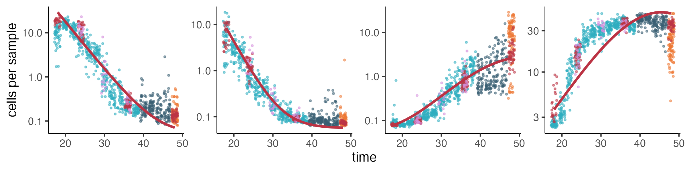
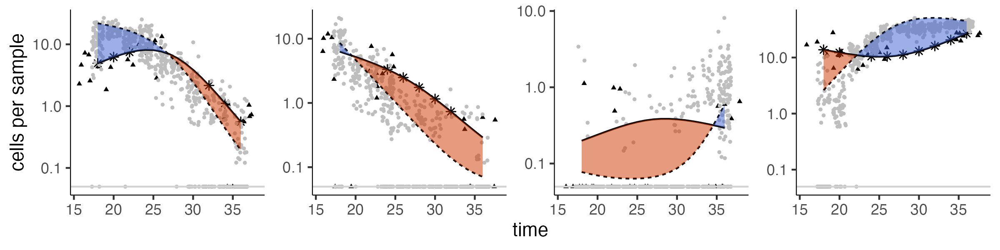

# Plotting control kinetics

```

muscle_wt_ccm = fit_wt_model(skeletal_muscle_cds, 
                             sample_group = "embryo", 
                             cell_group = "cell_type", 
                             perturbation_col = "perturbation", 
                             ctrl_ids = c(control_ids))
                             
```

The function`plot_cell_type_control_kinetics()`
* `wt_ccm`
* `start_time`
* `stop_time`
* `new_data`
* `color_points_by`
* `raw_counts`
```
plot_cell_type_control_kinetics(muscle_wt_ccm, 
                                start_time = 18, 
                                stop_time = 48, 
                                nrow = 2, 
                                newdata = tibble(expt = "GAP16"),
                                color_points_by = "expt",
                                raw_counts = F)

```


# Plotting perturbation kinetics

```
skeletal_muscle_comb_cds = load_monocle_objects("~/OneDrive/UW/Trapnell/hooke_manuscript/R_objects/partition_skeletal_ref_gap16_cds_v2.1.0/")

tbx16_msgn1_ccm = fit_mt_models(skeletal_muscle_comb_cds, 
                                sample_group = "embryo", 
                                cell_group = "cell_type", 
                                perturbation_col = "perturbation", 
                                ctrl_ids = c(control_ids), 
                                mt_ids = c("tbx16-msgn1"))


```


The function`plot_cell_type_perturb_kinetics()`
* `mt_ccm`
* `new_data`
* `raw_counts`
```
plot_cell_type_perturb_kinetics(tbx16_msgn1_ccm, 
                                newdata = tibble("expt"= "GAP16"), 
                                raw_counts = F, 
                                nrow = 2) + 
                                theme(text=element_text(family="Helvetica")) + 
                                xlab("time")
```